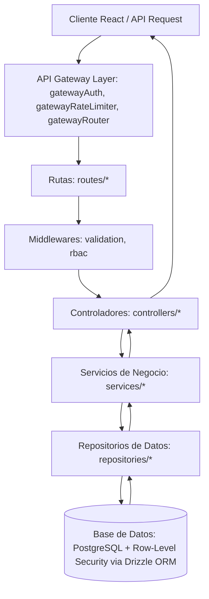

# Reporte del Sistema y Documentación Técnica Completa (MSP Client Portal)

Esta es la documentación técnica del monorepo **MSP Client Portal** (sistema de mesa de ayuda y suscripciones para proveedores de servicios gestionados). Este reporte ha sido generado automáticamente escaneando los archivos fuente del backend (servidores de Express + Drizzle ORM) y del frontend (React + Zustand + Tailwind CSS v4).

---

## 1. Arquitectura General del Sistema

El proyecto sigue una arquitectura de **Monolito Modular (Modular Monolith)** utilizando el stack **PERN (PostgreSQL, Express, React, Node.js)**. Se encuentra estructurado bajo un monorepo con un directorio para el frontend (`client/`) y otro para el backend (`server/`).

### Flujo de Datos del Servidor (Capas backend):
El servidor Express implementa una separación estricta de responsabilidades (Separation of Concerns):


1. **Capa API Gateway (`shared/middleware/gateway*.ts`):** Punto de entrada unificado que ejecuta la decodificación de JWT, la inyección de cabeceras estándar (`X-User-Id`, `X-Tenant-Id`), el control de tasa de peticiones por inquilino (*Multi-Tenant Rate Limiting*) y el enrutamiento a clústeres.
2. **Middleware de Autorización Universal (`shared/middleware/authzMiddleware.ts`):** Fábrica declarativa `authorize(action, resourceType, extractResource)` que conecta las rutas de Express con el Policy Decision Point (PDP) híbrido.
3. **Rutas (`routes/`):** Define los endpoints de la API. No contiene lógica de negocio, solo delega en los controladores correspondientes.
4. **Controladores (`controllers/`):** Manejan la entrada HTTP (`req`, `res`), validan las entradas de datos (usando Zod a través de middlewares) y delegan la lógica de negocio a los servicios.
5. **Servicios (`services/`):** Contienen toda la lógica de negocio nuclear del sistema (e.g., asignación de tickets mediante Round-Robin, políticas de SLA de 1 hora, facturación automática, sincronización con Nextcloud). No tienen conocimiento de la capa HTTP.
6. **Repositorios (`repositories/`):** Es la única capa autorizada para realizar consultas SQL (o sentencias Drizzle) a la base de datos PostgreSQL.
7. **Seguridad a Nivel de Fila (RLS) y Esquema DB (`shared/db/`):** Define las tablas relacionales y sus políticas de aislamiento por inquilino (*Row-Level Security*) usando `app.current_tenant_id` y `withTenantContext`.
8. **Motor de Autorización SOTA (`shared/authz/`):** Subsistema de autorización híbrido desacoplado (*Policy Decision Point - PDP*) que unifica tres capas de seguridad:
   - **RBAC (Control Coarse-Grained):** Verificación de identidad y roles base (`CLIENT`, `TECHNICIAN`, `ADMIN`).
   - **ReBAC (Zanzibar Graph Engine - `ZanzibarTupleStore`):** Evaluación de tuplas de relación `<sujeto>#<relación>@<objeto>` con herencia jerárquica (`owner` $\rightarrow$ `editor` $\rightarrow$ `viewer`).
   - **ABAC / Policy-as-Code (`PolicyAsCodeEngine`):** Predicados contextuales dinámicos versionados (ventana SLA de 1 hora `BL-101`, aislamiento multi-inquilino estricto, y escala de impagos `BL-702`).
   - **Seguridad Vectorial para IA/RAG (`VectorAclService`):** Autorización de doble fase con pre-filtrado SQL/pgvector y sanitización post-recuperación de chunks de conocimiento.
   - **Confianza Adaptativa Continua & Minería de Roles (`ContinuousAdaptiveTrustService`):** Detección en tiempo real de anomalías de sesión (viaje imposible, exfiltración masiva de datos) y optimización de permisos no utilizados mediante clustering no supervisado.

---

## 2. Modelos de la Base de Datos (PostgreSQL via Drizzle ORM)

La base de datos está modelada para soportar **Multi-tenancy (Multi-inquilino)** mediante la columna `tenant_id` presente en casi todas las tablas nucleares. A continuación se detallan los modelos definidos en [schema.ts](file:///c:/Users/DELL/Desktop/wordspace/msp_client_portal/server/src/shared/db/schema.ts):

| Tabla / Modelo | Propósito | Campos Clave |
| :--- | :--- | :--- |
| **tenants** | Inquilinos del portal (empresas cliente directas). | `id`, `name`, `subdomain`, `rnc`, `account_status` (ACTIVE, READ_ONLY, SUSPENDED, PURGED), `read_only_at`, `suspended_at`, `purged_at`, `created_at`, `updated_at` |
| **users** | Usuarios del sistema con roles diferenciados. | `id`, `email`, `name`, `password_hash`, `role` (CLIENT, TECHNICIAN, ADMIN), `account_status`, `rnc`, `specialty`, `is_active`, `tenant_id` |
| **tickets** | Entidades de solicitudes de soporte. | `id`, `title`, `description`, `category` (REPAIR, WARRANTY, SERVICE_OUTAGE), `status` (OPEN, IN_PROGRESS, AWAITING_PAYMENT, etc.), `priority`, `client_id`, `assigned_tech_id`, `tenant_id` |
| **ticket_attachments** | Archivos adjuntos para tickets o respuestas. | `id`, `ticket_id`, `response_id`, `filename`, `path`, `mime_type`, `size_bytes`, `tenant_id` |
| **ticket_events** | Registro histórico de cambios de estado del ticket. | `id`, `ticket_id`, `old_status`, `new_status`, `changed_by`, `notes` |
| **ticket_responses** | Mensajes e interacciones (hilo de discusión) del ticket. | `id`, `ticket_id`, `user_id`, `message`, `tenant_id` |
| **plans** | Planes de suscripción disponibles en la plataforma. | `id`, `name`, `description`, `price`, `features`, `recommended`, `client_type`, `active` |
| **subscriptions** | Suscripciones de clientes ligadas a planes. | `id`, `client_id`, `service_name`, `plan` (ID del plan), `status`, `renewal_date`, `equipment_count`, `paypal_order_id`, `tenant_id` |
| **subscription_equipment** | Dispositivos/slots asignados a una suscripción (e.g. Nextcloud). | `id`, `subscription_id`, `slot_index`, `status` (PENDING_ACTIVATION, ACTIVE), `device_name`, `device_serial`, `otp`, `nextcloud_username`, `nextcloud_password`, `tenant_id` |
| **invoices** | Facturas de clientes generadas para sus suscripciones. | `id`, `invoice_number`, `client_id`, `amount`, `tax_amount` (18% ITBIS), `total`, `currency` (USD, DOP), `ncf` (Serie B01), `rnc`, `status` (PENDING, PAID, OVERDUE), `due_date`, `tenant_id` |
| **round_robin_state** | Estado del asignador Round-Robin para técnicos. | `category`, `last_assigned_tech_id`, `updated_at` |
| **notifications** | Notificaciones internas del sistema. | `id`, `user_id`, `title`, `message`, `link`, `ticket_id`, `read`, `tenant_id` |
| **notification_preferences** | Preferencias de canal por evento. | `id`, `user_id`, `preferences` (JSON de canales in_app, email, whatsapp por evento), `tenant_id` |
| **expenses** | Gastos operativos registrados en el sistema. | `id`, `amount`, `description`, `category`, `expense_date`, `tenant_id` |

---

## 3. Interfaces del Sistema

Definidas centralmente en [types/index.ts](file:///c:/Users/DELL/Desktop/wordspace/msp_client_portal/server/src/shared/types/index.ts), representan los contratos de tipos en el servidor y ayudan a mantener la integridad de datos:

- **Enums de Dominio:**
  - `UserRole`: CLIENT, TECHNICIAN, ADMIN
  - `AccountStatus`: ACTIVE, READ_ONLY, SUSPENDED, PURGED
  - `Currency`: USD, DOP
  - `TicketStatus`: OPEN, IN_PROGRESS, AWAITING_PAYMENT, RESOLVED, CLOSED, CANCELLED
  - `TicketCategory`: REPAIR, WARRANTY, SERVICE_OUTAGE
  - `TicketPriority`: LOW, MEDIUM, HIGH, CRITICAL
  - `SubscriptionPlan`: BASIC, STANDARD, PREMIUM, PL-001...PL-007
  - `SubscriptionStatus`: ACTIVE, EXPIRING, EXPIRED, CANCELLED
  - `InvoiceStatus`: PENDING, PAID, OVERDUE
- **Interfaces de Entidad:** Mapean directamente los tipos devueltos por Drizzle ORM (`Tenant`, `User`, `Ticket`, `TicketAttachment`, `TicketEvent`, `TicketResponse`, `Subscription`, `Invoice`, `RoundRobinState`, `Notification`, `NotificationPreference`, `SubscriptionEquipment`, `Expense`).
- **Interfaces Auxiliares/API:**
  - `ApiResponse<T>`: Formato estándar de respuesta HTTP.
  - `ValidationError`: Estructura para errores de validación de esquemas Zod.
  - `PaginatedResponse<T>`: Envoltura para respuestas con paginación.
  - `JwtPayload`: Atributos codificados en el token JWT (`userId`, `email`, `role`, `tenantId`).
  - `AuthTokens`: Tokens emitidos (`accessToken`, `refreshToken`).
  - `TicketFilters`: Parámetros permitidos para buscar tickets.

---

## 4. Detalle Completo de Clases, Métodos y Funciones del Backend

A continuación se detalla la estructura física del backend organizada por capas:

### 4.1. Repositorios (Capa de Acceso a Datos - `server/src/modules/<domain>/repositories/`)

Esta capa ejecuta las consultas directas en Drizzle o queries SQL brutas.

Todos los repositorios heredan CRUD genérico de la clase abstracta `BaseRepository` de Drizzle.

#### [BaseRepository.ts](./file:/c:/Users/DELL/Desktop/wordspace/msp_client_portal/server/src/shared/repositories/BaseRepository.ts)
*Ruta: `server/src/shared/repositories/BaseRepository.ts`*

##### Clase: `BaseRepository`
| Método / Función | Argumentos | Descripción / Rol |
| :--- | :--- | :--- |
| `constructor` | `protected readonly table: any, protected readonly tableName: string` | Inicializador del componente e inyección de dependencias |
| `findById` | `id: string` | Mapeo o funcionalidad interna |
| `findAll` | `limit = 20, offset = 0` | Mapeo o funcionalidad interna |
| `count` | `whereClause = '', params: unknown[] = []` | Mapeo o funcionalidad interna |
| `deleteById` | `id: string` | Mapeo o funcionalidad interna |


#### [EquipmentRepository.ts](./file:/c:/Users/DELL/Desktop/wordspace/msp_client_portal/server/src/modules/equipment/repositories/EquipmentRepository.ts)
*Ruta: `server/src/modules/equipment/repositories/EquipmentRepository.ts`*

##### Clase: `EquipmentRepository`
| Método / Función | Argumentos | Descripción / Rol |
| :--- | :--- | :--- |
| `constructor` | `Ninguno` | Inicializador del componente e inyección de dependencias |
| `findBySubscription` | `subscriptionId: string` | Mapeo o funcionalidad interna |
| `findBySlot` | `subscriptionId: string, slotIndex: number` | Mapeo o funcionalidad interna |
| `findByOtp` | `otp: string` | Mapeo o funcionalidad interna |
| `create` | `data: { subscription_id: string; slot_index: number; status: 'PENDING_ACTIVATION' | 'ACTIVE'; device_name?: string; device_serial?: string; otp?: string; otp_expires_at?: Date; nextcloud_username?: string; nextcloud_password?: string; tenant_id: string; }` | Mapeo o funcionalidad interna |
| `update` | `id: string, data: Partial<SubscriptionEquipment>` | Mapeo o funcionalidad interna |
| `findActiveByClient` | `clientId: string, tenantId: string` | Mapeo o funcionalidad interna |
| `findAllWithDetails` | `Ninguno` | Mapeo o funcionalidad interna |


#### [ExpenseRepository.ts](./file:/c:/Users/DELL/Desktop/wordspace/msp_client_portal/server/src/modules/billing/repositories/ExpenseRepository.ts)
*Ruta: `server/src/modules/billing/repositories/ExpenseRepository.ts`*

##### Clase: `ExpenseRepository`
| Método / Función | Argumentos | Descripción / Rol |
| :--- | :--- | :--- |
| `constructor` | `Ninguno` | Inicializador del componente e inyección de dependencias |
| `findByTenant` | `tenantId: string, limit = 20, offset = 0` | Mapeo o funcionalidad interna |
| `countByTenant` | `tenantId: string` | Mapeo o funcionalidad interna |
| `getAllForStats` | `tenantId?: string` | Mapeo o funcionalidad interna |
| `create` | `data: { amount: number; description: string; category: string; expense_date: Date; tenant_id: string; expense_identifier?: string | null; }` | Mapeo o funcionalidad interna |


#### [InvoiceRepository.ts](./file:/c:/Users/DELL/Desktop/wordspace/msp_client_portal/server/src/modules/billing/repositories/InvoiceRepository.ts)
*Ruta: `server/src/modules/billing/repositories/InvoiceRepository.ts`*

##### Clase: `InvoiceRepository`
| Método / Función | Argumentos | Descripción / Rol |
| :--- | :--- | :--- |
| `constructor` | `Ninguno` | Inicializador del componente e inyección de dependencias |
| `findByTenant` | `tenantId: string, limit = 20, offset = 0` | Mapeo o funcionalidad interna |
| `findByInvoiceNumber` | `invoiceNumber: string` | Mapeo o funcionalidad interna |
| `create` | `data: { invoice_number: string; client_id: string; amount: number; tax_amount: number; total: number; due_date: Date; tenant_id: string; status?: InvoiceStatus; }` | Mapeo o funcionalidad interna |
| `updateStatus` | `id: string, status: InvoiceStatus` | Mapeo o funcionalidad interna |
| `countByTenant` | `tenantId: string` | Mapeo o funcionalidad interna |
| `getAllForStats` | `tenantId?: string` | Mapeo o funcionalidad interna |


#### [NotificationPreferenceRepository.ts](./file:/c:/Users/DELL/Desktop/wordspace/msp_client_portal/server/src/modules/notifications/repositories/NotificationPreferenceRepository.ts)
*Ruta: `server/src/modules/notifications/repositories/NotificationPreferenceRepository.ts`*

##### Clase: `NotificationPreferenceRepository`
| Método / Función | Argumentos | Descripción / Rol |
| :--- | :--- | :--- |
| `constructor` | `Ninguno` | Inicializador del componente e inyección de dependencias |
| `findByUserId` | `userId: string` | Mapeo o funcionalidad interna |
| `upsert` | `userId: string, tenantId: string, preferences: NotificationPreferencesMap` | Mapeo o funcionalidad interna |
| `getEffectivePreferences` | `userId: string` | Mapeo o funcionalidad interna |


#### [NotificationRepository.ts](./file:/c:/Users/DELL/Desktop/wordspace/msp_client_portal/server/src/modules/notifications/repositories/NotificationRepository.ts)
*Ruta: `server/src/modules/notifications/repositories/NotificationRepository.ts`*

##### Clase: `NotificationRepository`
| Método / Función | Argumentos | Descripción / Rol |
| :--- | :--- | :--- |
| `constructor` | `Ninguno` | Inicializador del componente e inyección de dependencias |
| `create` | `data: { user_id: string; title: string; message: string; link?: string; ticket_id?: string; type: string; metadata?: Record<string, any>; tenant_id: string; }` | Mapeo o funcionalidad interna |
| `findByUser` | `userId: string, limit = 50, offset = 0` | Mapeo o funcionalidad interna |
| `getUnreadCount` | `userId: string` | Mapeo o funcionalidad interna |
| `markAsRead` | `id: string, userId: string` | Mapeo o funcionalidad interna |
| `markAllAsRead` | `userId: string` | Mapeo o funcionalidad interna |
| `deleteAllForUser` | `userId: string` | Mapeo o funcionalidad interna |


#### [PlanRepository.ts](./file:/c:/Users/DELL/Desktop/wordspace/msp_client_portal/server/src/modules/subscriptions/repositories/PlanRepository.ts)
*Ruta: `server/src/modules/subscriptions/repositories/PlanRepository.ts`*

##### Clase: `PlanRepository`
| Método / Función | Argumentos | Descripción / Rol |
| :--- | :--- | :--- |
| `constructor` | `Ninguno` | Inicializador del componente e inyección de dependencias |
| `create` | `data: Omit<Plan, 'created_at' | 'updated_at'>` | Mapeo o funcionalidad interna |
| `update` | `id: string, data: Partial<Omit<Plan, 'id' | 'created_at' | 'updated_at'>>` | Mapeo o funcionalidad interna |


#### [SubscriptionRepository.ts](./file:/c:/Users/DELL/Desktop/wordspace/msp_client_portal/server/src/modules/subscriptions/repositories/SubscriptionRepository.ts)
*Ruta: `server/src/modules/subscriptions/repositories/SubscriptionRepository.ts`*

##### Clase: `SubscriptionRepository`
| Método / Función | Argumentos | Descripción / Rol |
| :--- | :--- | :--- |
| `constructor` | `Ninguno` | Inicializador del componente e inyección de dependencias |
| `findByTenant` | `tenantId: string` | Mapeo o funcionalidad interna |
| `findByClient` | `clientId: string` | Mapeo o funcionalidad interna |
| `findByPaypalOrderId` | `paypalOrderId: string` | Mapeo o funcionalidad interna |
| `create` | `data: { client_id: string; service_name: string; plan: SubscriptionPlan; equipment_count: number; renewal_date: Date; tenant_id: string; paypal_order_id?: string; }` | Mapeo o funcionalidad interna |
| `updatePlan` | `id: string, plan: SubscriptionPlan, equipmentCount?: number` | Mapeo o funcionalidad interna |
| `updateStatus` | `id: string, status: SubscriptionStatus` | Mapeo o funcionalidad interna |
| `findPendingRenewal` | `now: Date` | Mapeo o funcionalidad interna |
| `updateRenewal` | `id: string, renewalDate: Date, status: SubscriptionStatus` | Mapeo o funcionalidad interna |
| `getActiveSubscriptionsWithPlan` | `tenantId?: string` | Mapeo o funcionalidad interna |


#### [TenantRepository.ts](./file:/c:/Users/DELL/Desktop/wordspace/msp_client_portal/server/src/modules/auth/repositories/TenantRepository.ts)
*Ruta: `server/src/modules/auth/repositories/TenantRepository.ts`*

##### Clase: `TenantRepository`
| Método / Función | Argumentos | Descripción / Rol |
| :--- | :--- | :--- |
| `constructor` | `Ninguno` | Inicializador del componente e inyección de dependencias |
| `create` | `name: string, subdomain?: string` | Mapeo o funcionalidad interna |
| `findByName` | `name: string` | Mapeo o funcionalidad interna |
| `findBySubdomain` | `subdomain: string` | Mapeo o funcionalidad interna |


#### [TicketEventRepository.ts](./file:/c:/Users/DELL/Desktop/wordspace/msp_client_portal/server/src/modules/tickets/repositories/TicketEventRepository.ts)
*Ruta: `server/src/modules/tickets/repositories/TicketEventRepository.ts`*

##### Clase: `TicketEventRepository`
| Método / Función | Argumentos | Descripción / Rol |
| :--- | :--- | :--- |
| `constructor` | `Ninguno` | Inicializador del componente e inyección de dependencias |
| `create` | `data: { ticket_id: string; old_status: TicketStatus | null; new_status: TicketStatus; changed_by: string; notes?: string; tenant_id: string; }` | Mapeo o funcionalidad interna |
| `findByTicket` | `ticketId: string` | Mapeo o funcionalidad interna |


#### [TicketRepository.ts](./file:/c:/Users/DELL/Desktop/wordspace/msp_client_portal/server/src/modules/tickets/repositories/TicketRepository.ts)
*Ruta: `server/src/modules/tickets/repositories/TicketRepository.ts`*

##### Clase: `TicketRepository`
| Método / Función | Argumentos | Descripción / Rol |
| :--- | :--- | :--- |
| `constructor` | `Ninguno` | Inicializador del componente e inyección de dependencias |
| `findById` | `id: string` | Mapeo o funcionalidad interna |
| `create` | `data: { title: string; description: string; category: TicketCategory; priority: TicketPriority; client_id: string; equipment_id?: string | null; tenant_id: string; }` | Mapeo o funcionalidad interna |
| `findByClient` | `clientId: string, limit = 20, offset = 0` | Mapeo o funcionalidad interna |
| `findByTechnician` | `techId: string, limit = 20, offset = 0` | Mapeo o funcionalidad interna |
| `findWithFilters` | `filters: TicketFilters` | Mapeo o funcionalidad interna |
| `updateStatus` | `id: string, status: TicketStatus` | Mapeo o funcionalidad interna |
| `assignTechnician` | `id: string, techId: string` | Mapeo o funcionalidad interna |
| `countByStatus` | `clientId?: string, assignedTechId?: string, tenantId?: string` | Mapeo o funcionalidad interna |
| `addAttachment` | `data: { ticket_id: string; response_id?: string | null; filename: string; path: string; mime_type: string; size_bytes: number; tenant_id: string; }` | Mapeo o funcionalidad interna |
| `getAttachments` | `ticketId: string` | Mapeo o funcionalidad interna |
| `getAttachmentsByResponses` | `ticketId: string` | Mapeo o funcionalidad interna |


#### [TicketResponseRepository.ts](./file:/c:/Users/DELL/Desktop/wordspace/msp_client_portal/server/src/modules/tickets/repositories/TicketResponseRepository.ts)
*Ruta: `server/src/modules/tickets/repositories/TicketResponseRepository.ts`*

##### Clase: `TicketResponseRepository`
| Método / Función | Argumentos | Descripción / Rol |
| :--- | :--- | :--- |
| `constructor` | `Ninguno` | Inicializador del componente e inyección de dependencias |
| `create` | `data: { ticket_id: string; user_id: string; message: string; tenant_id: string; }` | Mapeo o funcionalidad interna |
| `findByTicket` | `ticketId: string` | Mapeo o funcionalidad interna |


#### [UserRepository.ts](./file:/c:/Users/DELL/Desktop/wordspace/msp_client_portal/server/src/modules/auth/repositories/UserRepository.ts)
*Ruta: `server/src/modules/auth/repositories/UserRepository.ts`*

##### Clase: `UserRepository`
| Método / Función | Argumentos | Descripción / Rol |
| :--- | :--- | :--- |
| `constructor` | `Ninguno` | Inicializador del componente e inyección de dependencias |
| `buildFilterConditions` | `filters: UserListFilters` | Mapeo o funcionalidad interna |
| `countWithFilters` | `filters: UserListFilters` | Mapeo o funcionalidad interna |
| `countByRole` | `Ninguno` | Mapeo o funcionalidad interna |
| `countByStatus` | `Ninguno` | Mapeo o funcionalidad interna |
| `updateRole` | `id: string, role: UserRole` | Mapeo o funcionalidad interna |
| `updateStatus` | `id: string, isActive: boolean` | Mapeo o funcionalidad interna |
| `findByEmail` | `email: string` | Mapeo o funcionalidad interna |
| `findByRole` | `role: UserRole` | Mapeo o funcionalidad interna |
| `findClientsByTenant` | `tenantId: string` | Mapeo o funcionalidad interna |
| `findAllClients` | `Ninguno` | Mapeo o funcionalidad interna |
| `findTechniciansBySpecialty` | `specialty: string` | Mapeo o funcionalidad interna |
| `findActiveTechnicians` | `Ninguno` | Mapeo o funcionalidad interna |
| `create` | `data: { email: string; name: string; password_hash: string; role?: UserRole; language?: string; tenant_id: string; client_type?: string; }` | Mapeo o funcionalidad interna |
| `updateProfile` | `id: string, data: Partial<Pick<User, 'name' | 'email' | 'language' | 'avatar_url'>>` | Mapeo o funcionalidad interna |
| `verifyEmail` | `id: string` | Mapeo o funcionalidad interna |
| `setOTP` | `id: string, otpCode: string, otpExpires: Date` | Mapeo o funcionalidad interna |
| `updatePassword` | `id: string, passwordHash: string` | Mapeo o funcionalidad interna |
| `updateLastLogin` | `id: string, ip: string` | Mapeo o funcionalidad interna |

##### Interfaces definidas:
- `UserListFilters`


---

### 4.2. Servicios (Capa de Lógica de Negocio - `server/src/modules/<domain>/services/`)

Esta capa orquesta las transacciones, valida reglas complejas (como SLAs y límites de equipos), distribuye llamadas de correo o facturación.

#### [AssignmentService.ts](./file:/c:/Users/DELL/Desktop/wordspace/msp_client_portal/server/src/modules/tickets/services/AssignmentService.ts)
*Ruta: `server/src/modules/tickets/services/AssignmentService.ts`*

##### Clase: `AssignmentService`
| Método / Función | Argumentos | Descripción / Rol |
| :--- | :--- | :--- |
| `getNextTechnician` | `category: TicketCategory, requestedSpecialty?: string` | Mapeo o funcionalidad interna |


#### [AuthService.ts](./file:/c:/Users/DELL/Desktop/wordspace/msp_client_portal/server/src/modules/auth/services/AuthService.ts)
*Ruta: `server/src/modules/auth/services/AuthService.ts`*

##### Clase: `AuthService`
| Método / Función | Argumentos | Descripción / Rol |
| :--- | :--- | :--- |
| `register` | `data: RegisterInput` | Mapeo o funcionalidad interna |
| `login` | `data: LoginInput, ipAddress: string` | Mapeo o funcionalidad interna |
| `googleAuth` | `data: GoogleAuthInput, ipAddress: string` | Mapeo o funcionalidad interna |
| `refreshToken` | `refreshToken: string` | Mapeo o funcionalidad interna |
| `verifyEmail` | `email: string, otp: string` | Mapeo o funcionalidad interna |
| `forgotPassword` | `email: string` | Mapeo o funcionalidad interna |
| `resetPassword` | `token: string, newPassword: string` | Mapeo o funcionalidad interna |
| `generateTokens` | `payload: JwtPayload` | Mapeo o funcionalidad interna |


#### [EquipmentService.ts](./file:/c:/Users/DELL/Desktop/wordspace/msp_client_portal/server/src/modules/equipment/services/EquipmentService.ts)
*Ruta: `server/src/modules/equipment/services/EquipmentService.ts`*

##### Clase: `EquipmentService`
| Método / Función | Argumentos | Descripción / Rol |
| :--- | :--- | :--- |
| `getEquipmentSlots` | `subscriptionId: string, tenantId: string, byAdmin = false` | Mapeo o funcionalidad interna |
| `generateSlotOTP` | `subscriptionId: string, slotIndex: number, tenantId: string, byAdmin = false` | Mapeo o funcionalidad interna |
| `activateSlot` | `options: { subscriptionId?: string; slotIndex?: number; otp?: string; deviceName: string; deviceSerial: string; tenantId: string; byAdmin?: boolean; }` | Mapeo o funcionalidad interna |
| `deactivateSlot` | `subscriptionId: string, slotIndex: number, tenantId: string, byAdmin = false` | Mapeo o funcionalidad interna |
| `getActiveDevicesForClient` | `clientId: string, tenantId: string` | Mapeo o funcionalidad interna |
| `getAllDevicesForAdmin` | `Ninguno` | Mapeo o funcionalidad interna |


#### [ExpenseService.ts](./file:/c:/Users/DELL/Desktop/wordspace/msp_client_portal/server/src/modules/billing/services/ExpenseService.ts)
*Ruta: `server/src/modules/billing/services/ExpenseService.ts`*

##### Clase: `ExpenseService`
| Método / Función | Argumentos | Descripción / Rol |
| :--- | :--- | :--- |
| `getExpenses` | `tenantId: string, userRole: UserRole, page = 1, limit = 20` | Mapeo o funcionalidad interna |
| `getExpenseById` | `id: string, tenantId: string, userRole: UserRole` | Mapeo o funcionalidad interna |
| `createExpense` | `data: { amount: number; description: string; category: string; expense_date: Date; tenant_id: string; expense_identifier?: string | null; }, userRole: UserRole` | Mapeo o funcionalidad interna |
| `deleteExpense` | `id: string, tenantId: string, userRole: UserRole` | Mapeo o funcionalidad interna |


#### [InvoiceService.ts](./file:/c:/Users/DELL/Desktop/wordspace/msp_client_portal/server/src/modules/billing/services/InvoiceService.ts)
*Ruta: `server/src/modules/billing/services/InvoiceService.ts`*

##### Clase: `InvoiceService`
| Método / Función | Argumentos | Descripción / Rol |
| :--- | :--- | :--- |
| `getClientInvoices` | `tenantId: string, userRole: UserRole, page = 1, limit = 20` | Mapeo o funcionalidad interna |
| `getInvoiceById` | `id: string, tenantId: string, userRole: UserRole` | Mapeo o funcionalidad interna |
| `createPaypalOrder` | `id: string, tenantId: string, userRole: UserRole` | Mapeo o funcionalidad interna |
| `capturePaypalOrder` | `id: string, paypalOrderId: string, tenantId: string, userRole: UserRole` | Mapeo o funcionalidad interna |
| `downloadInvoice` | `id: string, tenantId: string, userRole: UserRole, lang?: string` | Mapeo o funcionalidad interna |
| `getFinancialStats` | `tenantId: string, userRole: UserRole, range: '30_days' | 'quarter' | 'year'` | Mapeo o funcionalidad interna |
| `Date` | `allInvoices[0].invoice_date` | Mapeo o funcionalidad interna |


#### [NextcloudService.ts](./file:/c:/Users/DELL/Desktop/wordspace/msp_client_portal/server/src/modules/system/services/NextcloudService.ts)
*Ruta: `server/src/modules/system/services/NextcloudService.ts`*

##### Clase: `NextcloudService`
| Método / Función | Argumentos | Descripción / Rol |
| :--- | :--- | :--- |
| `getStorageUsage` | `Ninguno` | Mapeo o funcionalidad interna |
| `parseQuotaXml` | `xmlText: string` | Mapeo o funcionalidad interna |
| `provisionUser` | `options: { username: string; email?: string; quota?: string; displayName?: string; }` | Mapeo o funcionalidad interna |
| `Error` | ``Nextcloud OCS error (${statusCode}` | Mapeo o funcionalidad interna |
| `deleteUser` | `username: string` | Mapeo o funcionalidad interna |
| `Error` | ``Nextcloud OCS error (${statusCode}` | Mapeo o funcionalidad interna |
| `getUserStorage` | `username: string` | Mapeo o funcionalidad interna |
| `Error` | ``Nextcloud OCS error (${statusCode}` | Mapeo o funcionalidad interna |
| `getFallbackStatus` | `Ninguno` | Mapeo o funcionalidad interna |

##### Interfaces definidas:
- `StorageStatus`


#### [NotificationPreferenceService.ts](./file:/c:/Users/DELL/Desktop/wordspace/msp_client_portal/server/src/modules/notifications/services/NotificationPreferenceService.ts)
*Ruta: `server/src/modules/notifications/services/NotificationPreferenceService.ts`*

##### Clase: `NotificationPreferenceService`
| Método / Función | Argumentos | Descripción / Rol |
| :--- | :--- | :--- |
| `getPreferences` | `userId: string` | Mapeo o funcionalidad interna |
| `updatePreferences` | `userId: string, tenantId: string, preferences: NotificationPreferencesMap` | Mapeo o funcionalidad interna |
| `shouldNotify` | `userId: string, eventType: NotificationEventType, channel: 'in_app' | 'email' | 'whatsapp'` | Mapeo o funcionalidad interna |


#### [NotificationService.ts](./file:/c:/Users/DELL/Desktop/wordspace/msp_client_portal/server/src/modules/notifications/services/NotificationService.ts)
*Ruta: `server/src/modules/notifications/services/NotificationService.ts`*

##### Clase: `NotificationService`
| Método / Función | Argumentos | Descripción / Rol |
| :--- | :--- | :--- |
| `registerSSEClient` | `userId: string, res: Response` | Mapeo o funcionalidad interna |
| `sendRealTimeUpdate` | `userId: string, event: string, data: any` | Mapeo o funcionalidad interna |
| `createInAppNotification` | `data: { userId: string; title: string; message: string; link?: string; ticketId?: string; type: string; metadata?: Record<string, any>; tenantId: string; }` | Mapeo o funcionalidad interna |
| `onTicketCreated` | `ticket: Ticket, client: User` | Mapeo o funcionalidad interna |
| `onTicketStatusChanged` | `ticket: Ticket, client: User, notes?: string` | Mapeo o funcionalidad interna |
| `onTicketAssigned` | `ticket: Ticket, technician: User` | Mapeo o funcionalidad interna |
| `onTicketResponseCreated` | `ticket: Ticket, recipient: User, senderName: string, message: string` | Mapeo o funcionalidad interna |


#### [PaypalService.ts](./file:/c:/Users/DELL/Desktop/wordspace/msp_client_portal/server/src/modules/billing/services/PaypalService.ts)
*Ruta: `server/src/modules/billing/services/PaypalService.ts`*

##### Clase: `PaypalService`
| Método / Función | Argumentos | Descripción / Rol |
| :--- | :--- | :--- |
| `baseUrl` | `Ninguno` | Mapeo o funcionalidad interna |
| `isMockMode` | `Ninguno` | Mapeo o funcionalidad interna |
| `getAccessToken` | `Ninguno` | Mapeo o funcionalidad interna |
| `createOrder` | `invoice: Invoice` | Mapeo o funcionalidad interna |
| `captureOrder` | `paypalOrderId: string` | Mapeo o funcionalidad interna |
| `getOrder` | `paypalOrderId: string` | Mapeo o funcionalidad interna |
| `createOrderForAmount` | `amount: number, description: string, referenceId: string` | Mapeo o funcionalidad interna |
| `createProduct` | `name: string, description: string` | Mapeo o funcionalidad interna |
| `createPlan` | `productId: string, name: string, description: string, price: number, billingCycle: 'monthly' | 'annual'` | Mapeo o funcionalidad interna |
| `createSubscription` | `paypalPlanId: string, quantity: number, returnUrl: string, cancelUrl: string` | Mapeo o funcionalidad interna |
| `getSubscription` | `subscriptionId: string` | Mapeo o funcionalidad interna |
| `updateSubscriptionQuantity` | `subscriptionId: string, quantity: number` | Mapeo o funcionalidad interna |


#### [PlanService.ts](./file:/c:/Users/DELL/Desktop/wordspace/msp_client_portal/server/src/modules/<domain>/services/PlanService.ts)
*Ruta: `server/src/modules/<domain>/services/PlanService.ts`*

##### Clase: `PlanService`
| Método / Función | Argumentos | Descripción / Rol |
| :--- | :--- | :--- |
| `getAllPlans` | `includeInactive = false` | Mapeo o funcionalidad interna |
| `getPlanById` | `id: string` | Mapeo o funcionalidad interna |
| `createPlan` | `data: CreatePlanInput` | Mapeo o funcionalidad interna |
| `updatePlan` | `id: string, data: UpdatePlanInput` | Mapeo o funcionalidad interna |


#### [SubscriptionScheduler.ts](./file:/c:/Users/DELL/Desktop/wordspace/msp_client_portal/server/src/modules/subscriptions/services/SubscriptionScheduler.ts)
*Ruta: `server/src/modules/subscriptions/services/SubscriptionScheduler.ts`*

##### Clase: `SubscriptionScheduler`
| Método / Función | Argumentos | Descripción / Rol |
| :--- | :--- | :--- |
| `start` | `intervalMs = 15000` | Mapeo o funcionalidad interna |
| `stop` | `Ninguno` | Mapeo o funcionalidad interna |
| `checkAndRenewSubscriptions` | `Ninguno` | Mapeo o funcionalidad interna |
| `renewSubscription` | `sub: Subscription` | Mapeo o funcionalidad interna |


#### [SubscriptionService.ts](./file:/c:/Users/DELL/Desktop/wordspace/msp_client_portal/server/src/modules/subscriptions/services/SubscriptionService.ts)
*Ruta: `server/src/modules/subscriptions/services/SubscriptionService.ts`*

##### Clase: `SubscriptionService`
| Método / Función | Argumentos | Descripción / Rol |
| :--- | :--- | :--- |
| `getClientSubscriptions` | `tenantId: string` | Mapeo o funcionalidad interna |
| `getSubscriptionById` | `id: string, tenantId: string` | Mapeo o funcionalidad interna |
| `createPaypalOrderForSubscription` | `data: { plan: string; equipmentCount: number; billingCycle?: 'monthly' | 'annual'; currentSubscriptionId?: string }` | Mapeo o funcionalidad interna |
| `createPaypalSubscription` | `data: { plan: string; equipmentCount: number; billingCycle?: 'monthly' | 'annual' }` | Mapeo o funcionalidad interna |
| `createSubscription` | `data: CreateSubscriptionInput, clientId: string, tenantId: string, byAdmin = false` | Mapeo o funcionalidad interna |
| `updateSubscription` | `id: string, data: UpdateSubscriptionInput, tenantId: string, byAdmin = false` | Mapeo o funcionalidad interna |
| `sendQuotation` | `data: SendQuoteInput, senderUserId: string, senderTenantId: string, role: string` | Mapeo o funcionalidad interna |


#### [TicketService.ts](./file:/c:/Users/DELL/Desktop/wordspace/msp_client_portal/server/src/modules/<domain>/services/TicketService.ts)
*Ruta: `server/src/modules/<domain>/services/TicketService.ts`*

##### Clase: `TicketService`
| Método / Función | Argumentos | Descripción / Rol |
| :--- | :--- | :--- |
| `createTicket` | `data: CreateTicketInput, clientId: string, tenantId: string` | Mapeo o funcionalidad interna |
| `getTicketById` | `ticketId: string, _userId: string, userRole: UserRole, tenantId: string` | Mapeo o funcionalidad interna |
| `getTickets` | `filters: TicketFilters, userId: string, userRole: UserRole, tenantId: string,` | Mapeo o funcionalidad interna |
| `updateTicketStatus` | `ticketId: string, data: UpdateTicketStatusInput, userId: string, userRole: UserRole, tenantId: string,` | Mapeo o funcionalidad interna |
| `getTicketTimeline` | `ticketId: string, userId: string, userRole: UserRole, tenantId: string` | Mapeo o funcionalidad interna |
| `getTicketAttachments` | `ticketId: string, userId: string, userRole: UserRole, tenantId: string` | Mapeo o funcionalidad interna |
| `addAttachment` | `ticketId: string, file: { filename: string; path: string; mimetype: string; size: number }, userId: string, userRole: UserRole, tenantId: string,` | Mapeo o funcionalidad interna |
| `getStatusSummary` | `userId: string, userRole: UserRole, tenantId: string` | Mapeo o funcionalidad interna |
| `assignTicket` | `ticketId: string, techId: string, userId: string,` | Mapeo o funcionalidad interna |
| `enforceSLARule` | `ticket: Ticket` | Mapeo o funcionalidad interna |
| `getTicketResponses` | `ticketId: string, userId: string, userRole: UserRole, tenantId: string,` | Mapeo o funcionalidad interna |
| `addTicketResponse` | `ticketId: string, message: string, userId: string, userRole: UserRole, tenantId: string, files: { filename: string; path: string; mimetype: string; size: number }[] = [],` | Mapeo o funcionalidad interna |


#### [UserService.ts](./file:/c:/Users/DELL/Desktop/wordspace/msp_client_portal/server/src/modules/auth/services/UserService.ts)
*Ruta: `server/src/modules/auth/services/UserService.ts`*

##### Clase: `UserService`
| Método / Función | Argumentos | Descripción / Rol |
| :--- | :--- | :--- |
| `getProfile` | `userId: string` | Mapeo o funcionalidad interna |
| `updateProfile` | `userId: string, data: UpdateProfileInput` | Mapeo o funcionalidad interna |
| `changePassword` | `userId: string, data: ChangePasswordInput` | Mapeo o funcionalidad interna |
| `getTechnicians` | `Ninguno` | Mapeo o funcionalidad interna |
| `getClients` | `Ninguno` | Mapeo o funcionalidad interna |
| `getAllUsers` | `params: { page?: number; limit?: number; role?: string; isActive?: string; search?: string; }` | Mapeo o funcionalidad interna |
| `updateUserRole` | `adminUserId: string, targetUserId: string, newRole: UserRole` | Mapeo o funcionalidad interna |
| `toggleUserStatus` | `adminUserId: string, targetUserId: string, isActive: boolean` | Mapeo o funcionalidad interna |
| `getUserStats` | `Ninguno` | Mapeo o funcionalidad interna |

##### Interfaces definidas:
- `UserListResponse`
- `UserStats`


---

### 4.3. Controladores (Capa de Entrada y Respuestas - `server/src/modules/<domain>/controllers/`)

Reciben peticiones HTTP de Express, extraen parámetros y llaman a la capa de Servicios.

#### [AuthController.ts](./file:/c:/Users/DELL/Desktop/wordspace/msp_client_portal/server/src/modules/auth/controllers/AuthController.ts)
*Ruta: `server/src/modules/auth/controllers/AuthController.ts`*

##### Clase: `AuthController`
| Método / Función | Argumentos | Descripción / Rol |
| :--- | :--- | :--- |
| `register` | `req: Request, res: Response` | Mapeo o funcionalidad interna |
| `googleAuth` | `req: Request, res: Response` | Mapeo o funcionalidad interna |
| `login` | `req: Request, res: Response` | Mapeo o funcionalidad interna |
| `refreshToken` | `req: Request, res: Response` | Mapeo o funcionalidad interna |
| `forgotPassword` | `req: Request, res: Response` | Mapeo o funcionalidad interna |
| `resetPassword` | `req: Request, res: Response` | Mapeo o funcionalidad interna |
| `verifyEmail` | `req: Request, res: Response` | Mapeo o funcionalidad interna |


#### [EquipmentController.ts](./file:/c:/Users/DELL/Desktop/wordspace/msp_client_portal/server/src/modules/equipment/controllers/EquipmentController.ts)
*Ruta: `server/src/modules/equipment/controllers/EquipmentController.ts`*

##### Clase: `EquipmentController`
| Método / Función | Argumentos | Descripción / Rol |
| :--- | :--- | :--- |
| `getSlots` | `req: Request, res: Response, next: NextFunction` | Mapeo o funcionalidad interna |
| `generateOTP` | `req: Request, res: Response, next: NextFunction` | Mapeo o funcionalidad interna |
| `activateSlot` | `req: Request, res: Response, next: NextFunction` | Mapeo o funcionalidad interna |
| `deactivateSlot` | `req: Request, res: Response, next: NextFunction` | Mapeo o funcionalidad interna |
| `getMyDevices` | `req: Request, res: Response, next: NextFunction` | Mapeo o funcionalidad interna |
| `getAllDevicesForAdmin` | `_req: Request, res: Response, next: NextFunction` | Mapeo o funcionalidad interna |


#### [ExpenseController.ts](./file:/c:/Users/DELL/Desktop/wordspace/msp_client_portal/server/src/modules/billing/controllers/ExpenseController.ts)
*Ruta: `server/src/modules/billing/controllers/ExpenseController.ts`*

##### Clase: `ExpenseController`
| Método / Función | Argumentos | Descripción / Rol |
| :--- | :--- | :--- |
| `getAll` | `req: Request, res: Response, next: NextFunction` | Mapeo o funcionalidad interna |
| `getById` | `req: Request, res: Response, next: NextFunction` | Mapeo o funcionalidad interna |
| `create` | `req: Request, res: Response, next: NextFunction` | Mapeo o funcionalidad interna |
| `delete` | `req: Request, res: Response, next: NextFunction` | Mapeo o funcionalidad interna |


#### [InvoiceController.ts](./file:/c:/Users/DELL/Desktop/wordspace/msp_client_portal/server/src/modules/billing/controllers/InvoiceController.ts)
*Ruta: `server/src/modules/billing/controllers/InvoiceController.ts`*

##### Clase: `InvoiceController`
| Método / Función | Argumentos | Descripción / Rol |
| :--- | :--- | :--- |
| `getAll` | `req: Request, res: Response` | Mapeo o funcionalidad interna |
| `getById` | `req: Request, res: Response` | Mapeo o funcionalidad interna |
| `createPaypalOrder` | `req: Request, res: Response` | Mapeo o funcionalidad interna |
| `capturePaypalOrder` | `req: Request, res: Response` | Mapeo o funcionalidad interna |
| `download` | `req: Request, res: Response` | Mapeo o funcionalidad interna |
| `getFinancialStats` | `req: Request, res: Response` | Mapeo o funcionalidad interna |


#### [NotificationController.ts](./file:/c:/Users/DELL/Desktop/wordspace/msp_client_portal/server/src/modules/notifications/controllers/NotificationController.ts)
*Ruta: `server/src/modules/notifications/controllers/NotificationController.ts`*

##### Clase: `NotificationController`
| Método / Función | Argumentos | Descripción / Rol |
| :--- | :--- | :--- |
| `getAll` | `req: Request, res: Response` | Mapeo o funcionalidad interna |
| `markAsRead` | `req: Request, res: Response` | Mapeo o funcionalidad interna |
| `markAllAsRead` | `req: Request, res: Response` | Mapeo o funcionalidad interna |
| `clearAll` | `req: Request, res: Response` | Mapeo o funcionalidad interna |
| `stream` | `req: Request, res: Response` | Mapeo o funcionalidad interna |


#### [NotificationPreferenceController.ts](./file:/c:/Users/DELL/Desktop/wordspace/msp_client_portal/server/src/modules/notifications/controllers/NotificationPreferenceController.ts)
*Ruta: `server/src/modules/notifications/controllers/NotificationPreferenceController.ts`*

##### Clase: `NotificationPreferenceController`
| Método / Función | Argumentos | Descripción / Rol |
| :--- | :--- | :--- |
| `getPreferences` | `req: Request, res: Response` | Mapeo o funcionalidad interna |
| `updatePreferences` | `req: Request, res: Response` | Mapeo o funcionalidad interna |


#### [PlanController.ts](./file:/c:/Users/DELL/Desktop/wordspace/msp_client_portal/server/src/modules/subscriptions/controllers/PlanController.ts)
*Ruta: `server/src/modules/subscriptions/controllers/PlanController.ts`*

##### Clase: `PlanController`
| Método / Función | Argumentos | Descripción / Rol |
| :--- | :--- | :--- |
| `getAll` | `req: Request, res: Response` | Mapeo o funcionalidad interna |
| `getById` | `req: Request, res: Response` | Mapeo o funcionalidad interna |
| `create` | `req: Request, res: Response` | Mapeo o funcionalidad interna |
| `update` | `req: Request, res: Response` | Mapeo o funcionalidad interna |


#### [SubscriptionController.ts](./file:/c:/Users/DELL/Desktop/wordspace/msp_client_portal/server/src/modules/subscriptions/controllers/SubscriptionController.ts)
*Ruta: `server/src/modules/subscriptions/controllers/SubscriptionController.ts`*

##### Clase: `SubscriptionController`
| Método / Función | Argumentos | Descripción / Rol |
| :--- | :--- | :--- |
| `getAll` | `req: Request, res: Response` | Mapeo o funcionalidad interna |
| `getById` | `req: Request, res: Response` | Mapeo o funcionalidad interna |
| `create` | `req: Request, res: Response` | Mapeo o funcionalidad interna |
| `createPaypalOrder` | `req: Request, res: Response, next: NextFunction` | Mapeo o funcionalidad interna |
| `createPaypalSubscription` | `req: Request, res: Response, next: NextFunction` | Mapeo o funcionalidad interna |
| `update` | `req: Request, res: Response` | Mapeo o funcionalidad interna |
| `sendQuote` | `req: Request, res: Response` | Mapeo o funcionalidad interna |


#### [SystemController.ts](./file:/c:/Users/DELL/Desktop/wordspace/msp_client_portal/server/src/modules/system/controllers/SystemController.ts)
*Ruta: `server/src/modules/system/controllers/SystemController.ts`*

##### Clase: `SystemController`
| Método / Función | Argumentos | Descripción / Rol |
| :--- | :--- | :--- |
| `getStorageStatus` | `_req: Request, res: Response, next: NextFunction` | Mapeo o funcionalidad interna |


#### [TicketController.ts](./file:/c:/Users/DELL/Desktop/wordspace/msp_client_portal/server/src/modules/tickets/controllers/TicketController.ts)
*Ruta: `server/src/modules/tickets/controllers/TicketController.ts`*

##### Clase: `TicketController`
| Método / Función | Argumentos | Descripción / Rol |
| :--- | :--- | :--- |
| `create` | `req: Request, res: Response` | Mapeo o funcionalidad interna |
| `getAll` | `req: Request, res: Response` | Mapeo o funcionalidad interna |
| `getById` | `req: Request, res: Response` | Mapeo o funcionalidad interna |
| `updateStatus` | `req: Request, res: Response` | Mapeo o funcionalidad interna |
| `getTimeline` | `req: Request, res: Response` | Mapeo o funcionalidad interna |
| `getAttachments` | `req: Request, res: Response` | Mapeo o funcionalidad interna |
| `uploadAttachment` | `req: Request, res: Response` | Mapeo o funcionalidad interna |
| `getStatusSummary` | `req: Request, res: Response` | Mapeo o funcionalidad interna |
| `assign` | `req: Request, res: Response` | Mapeo o funcionalidad interna |
| `getResponses` | `req: Request, res: Response` | Mapeo o funcionalidad interna |
| `createResponse` | `req: Request, res: Response` | Mapeo o funcionalidad interna |


#### [UserController.ts](./file:/c:/Users/DELL/Desktop/wordspace/msp_client_portal/server/src/modules/auth/controllers/UserController.ts)
*Ruta: `server/src/modules/auth/controllers/UserController.ts`*

##### Clase: `UserController`
| Método / Función | Argumentos | Descripción / Rol |
| :--- | :--- | :--- |
| `getProfile` | `req: Request, res: Response` | Mapeo o funcionalidad interna |
| `updateProfile` | `req: Request, res: Response` | Mapeo o funcionalidad interna |
| `changePassword` | `req: Request, res: Response` | Mapeo o funcionalidad interna |
| `getTechnicians` | `_req: Request, res: Response` | Mapeo o funcionalidad interna |
| `uploadAvatar` | `req: Request, res: Response` | Mapeo o funcionalidad interna |
| `getClients` | `_req: Request, res: Response` | Mapeo o funcionalidad interna |
| `getAllUsers` | `req: Request, res: Response` | Mapeo o funcionalidad interna |
| `Number` | `page` | Mapeo o funcionalidad interna |
| `getStats` | `_req: Request, res: Response` | Mapeo o funcionalidad interna |
| `updateRole` | `req: Request, res: Response` | Mapeo o funcionalidad interna |
| `toggleStatus` | `req: Request, res: Response` | Mapeo o funcionalidad interna |


---

### 4.4. Rutas y Middlewares (`server/src/modules/<domain>/routes/` y `server/src/shared/middleware/`)

Controles de acceso (RBAC), subida de archivos (Multer), autenticación por JWT y validaciones dinámicas con Zod.

#### Rutas definidoras:

#### Middlewares de apoyo:
#### [authMiddleware.ts](./file:/c:/Users/DELL/Desktop/wordspace/msp_client_portal/server/src/shared/middleware/authMiddleware.ts)
*Ruta: `server/src/shared/middleware/authMiddleware.ts`*

##### Funciones auxiliares / Standalone:
| Función | Parámetros | Descripción |
| :--- | :--- | :--- |
| `authMiddleware` | `req: Request, _res: Response, next: NextFunction` | Operación lógica directa |


#### [rbacMiddleware.ts](./file:/c:/Users/DELL/Desktop/wordspace/msp_client_portal/server/src/shared/middleware/rbacMiddleware.ts)
*Ruta: `server/src/shared/middleware/rbacMiddleware.ts`*

##### Funciones auxiliares / Standalone:
| Función | Parámetros | Descripción |
| :--- | :--- | :--- |
| `rbacMiddleware` | `...allowedRoles: UserRole[]` | Operación lógica directa |


#### [validationMiddleware.ts](./file:/c:/Users/DELL/Desktop/wordspace/msp_client_portal/server/src/shared/middleware/validationMiddleware.ts)
*Ruta: `server/src/shared/middleware/validationMiddleware.ts`*

##### Funciones auxiliares / Standalone:
| Función | Parámetros | Descripción |
| :--- | :--- | :--- |
| `validate` | `schema: ZodSchema, source: 'body' | 'query' | 'params' = 'body'` | Operación lógica directa |


---

### 4.5. DTOs y Utilidades del Backend (`server/src/dtos/` y `server/src/utils/`)

#### [AppError.ts](./file:/c:/Users/DELL/Desktop/wordspace/msp_client_portal/server/src/utils/AppError.ts)
*Ruta: `server/src/utils/AppError.ts`*

##### Clase: `AppError`
| Método / Función | Argumentos | Descripción / Rol |
| :--- | :--- | :--- |
| `constructor` | `message: string, statusCode: number = 500, code: string = 'INTERNAL_ERROR', isOperational: boolean = true, details?: Record<string, any>, originalError?: unknown` | Inicializador del componente e inyección de dependencias |
| `badRequest` | `message: string, code = 'BAD_REQUEST'` | Mapeo o funcionalidad interna |
| `unauthorized` | `message = 'Unauthorized', code = 'UNAUTHORIZED'` | Mapeo o funcionalidad interna |
| `forbidden` | `message = 'Forbidden', code = 'FORBIDDEN'` | Mapeo o funcionalidad interna |
| `notFound` | `message = 'Resource not found', code = 'NOT_FOUND'` | Mapeo o funcionalidad interna |
| `conflict` | `message: string, code = 'CONFLICT'` | Mapeo o funcionalidad interna |
| `slaViolation` | `message: string` | Mapeo o funcionalidad interna |
| `internal` | `message = 'Internal server error'` | Mapeo o funcionalidad interna |


#### [emailService.ts](./file:/c:/Users/DELL/Desktop/wordspace/msp_client_portal/server/src/utils/emailService.ts)
*Ruta: `server/src/utils/emailService.ts`*

##### Funciones auxiliares / Standalone:
| Función | Parámetros | Descripción |
| :--- | :--- | :--- |
| `sendEmail` | `payload: NotificationPayload` | Operación lógica directa |
| `sendTicketCreatedEmail` | `clientEmail: string, clientName: string, ticket: Ticket,` | Operación lógica directa |
| `sendTicketStatusChangedEmail` | `clientEmail: string, clientName: string, ticket: Ticket, notes?: string,` | Operación lógica directa |
| `sendTicketAssignedEmail` | `technicianEmail: string, technicianName: string, ticket: Ticket,` | Operación lógica directa |
| `sendTicketStatusEmail` | `clientEmail: string, ticketId: string, newStatus: string, notes?: string,` | Operación lógica directa |
| `sendTicketResponseEmail` | `recipientEmail: string, recipientName: string, senderName: string, ticket: Ticket, message: string,` | Operación lógica directa |
| `sendQuotationEmail` | `clientEmail: string, clientName: string, plan: Plan, billingCycle: 'monthly' | 'annual', equipmentCount: number, subtotal: number, tax: number, total: number, language: string,` | Operación lógica directa |


#### [passwordUtils.ts](./file:/c:/Users/DELL/Desktop/wordspace/msp_client_portal/server/src/utils/passwordUtils.ts)
*Ruta: `server/src/utils/passwordUtils.ts`*

##### Funciones auxiliares / Standalone:
| Función | Parámetros | Descripción |
| :--- | :--- | :--- |
| `hashPassword` | `password: string` | Operación lógica directa |
| `comparePassword` | `password: string, hash: string` | Operación lógica directa |


#### [emailService.ts](./file:/server/src/shared/utils/emailService.ts)
*Ruta: `server/src/shared/utils/emailService.ts`*

##### Funciones auxiliares / Standalone:
| Función | Parámetros | Descripción |
| :--- | :--- | :--- |
| `sendEmail` | `payload: NotificationPayload` | Envío de correo mediante Nodemailer (SMTP o Stub) |
| `sendPasswordResetEmail` | `recipientEmail, recipientName, resetToken, language?` | Envío de correo con enlace de restablecimiento de contraseña |
| `sendOTPEmail` | `recipientEmail, recipientName, otp, language?` | Envío de código de verificación de 6 dígitos (OTP) |
| `sendTicketCreatedEmail` | `clientEmail, clientName, ticket` | Envío de correo de bienvenida y acuse de recibo de ticket |
| `sendTicketStatusChangedEmail` | `clientEmail, clientName, ticket, notes?` | Envío de actualización de estado y comentarios del técnico |
| `sendTicketAssignedEmail` | `technicianEmail, technicianName, ticket` | Notificación de asignación de ticket para el técnico |
| `sendTicketResponseEmail` | `recipientEmail, recipientName, senderName, ticket, message` | Notificación de nueva respuesta agregada a un ticket |
| `sendInvoiceDueEmail` | `clientEmail, clientName, invoice, language` | Recordatorio de vencimiento y pago pendiente de factura |
| `sendQuotationEmail` | `clientEmail, clientName, plan, billingCycle, equipmentCount, subtotal, tax, total, language` | Envío de cotización formal de plan de soporte |


#### [pdfGenerator.ts](./file:/c:/Users/DELL/Desktop/wordspace/msp_client_portal/server/src/utils/pdfGenerator.ts)
*Ruta: `server/src/utils/pdfGenerator.ts`*

##### Funciones auxiliares / Standalone:
| Función | Parámetros | Descripción |
| :--- | :--- | :--- |
| `generateInvoicePdf` | `invoice: Invoice, clientName: string, clientEmail: string, tenantName: string, language = 'en_US'` | Operación lógica directa |


#### [whatsappService.ts](./file:/c:/Users/DELL/Desktop/wordspace/msp_client_portal/server/src/utils/whatsappService.ts)
*Ruta: `server/src/utils/whatsappService.ts`*

##### Funciones auxiliares / Standalone:
| Función | Parámetros | Descripción |
| :--- | :--- | :--- |
| `sendWhatsApp` | `payload: NotificationPayload` | Operación lógica directa |
| `sendTicketStatusWhatsApp` | `phoneNumber: string, ticketId: string, newStatus: string, notes?: string,` | Operación lógica directa |


---

## 5. Estructura y Componentes del Frontend (React + Zustand + React Router v7)

El frontend está ubicado en `client/`. Utiliza Zustand para la gestión de estados globales y Axios para comunicarse con los endpoints del backend.

### 5.0. Sistema de Diseño de Correos Electrónicos (`client/src/email-templates/`)

El frontend cuenta con un sistema de diseño de correos electrónicos homogéneo y basado en tokens (`tokens.ts`) con subcomponentes reutilizables (`components.tsx`), layout unificado (`EmailWrapper.tsx`) y galería de previsualización interactiva con soporte bilingüe (EN/ES) en la página de Preferencias de Notificación (`/notifications`).

- **Tokens (`tokens.ts`):** Paleta oceánica (`#0C4A6E`, `#38BDF8`, `#2563EB`), escala tipográfica, espaciados y sombras.
- **Componentes (`components.tsx`):** `Greeting`, `BodyText`, `InfoCard`, `DetailRow`, `Badge`, `Callout`, `Disclaimer`, `HighlightCode`, `FallbackLink`.
- **Plantillas:** `PasswordResetTemplate`, `OTPTemplate`, `TicketCreatedTemplate`, `InvoiceReminderTemplate`.

### 5.1. Manejadores de Estado Global (Zustand Stores - `client/src/store/`)

#### [useAuthStore.ts](./file:/c:/Users/DELL/Desktop/wordspace/msp_client_portal/client/src/store/useAuthStore.ts)
*Ruta: `client/src/store/useAuthStore.ts`*

##### Interfaces definidas:
- `AuthUser`
- `AuthState`


#### [useNotificationStore.ts](./file:/c:/Users/DELL/Desktop/wordspace/msp_client_portal/client/src/store/useNotificationStore.ts)
*Ruta: `client/src/store/useNotificationStore.ts`*

##### Interfaces definidas:
- `NotificationState`


#### [usePlanStore.ts](./file:/c:/Users/DELL/Desktop/wordspace/msp_client_portal/client/src/store/usePlanStore.ts)
*Ruta: `client/src/store/usePlanStore.ts`*

##### Interfaces definidas:
- `PlanState`


---

### 5.2. Llamadas a la API (Client Services - `client/src/services/`)

#### [authService.ts](./file:/c:/Users/DELL/Desktop/wordspace/msp_client_portal/client/src/services/authService.ts)
*Ruta: `client/src/services/authService.ts`*

##### Interfaces definidas:
- `LoginPayload`
- `RegisterPayload`
- `GoogleAuthPayload`
- `AuthResponse`


#### [equipmentService.ts](./file:/c:/Users/DELL/Desktop/wordspace/msp_client_portal/client/src/services/equipmentService.ts)
*Ruta: `client/src/services/equipmentService.ts`*

##### Interfaces definidas:
- `SubscriptionEquipment`


#### [expenseService.ts](./file:/c:/Users/DELL/Desktop/wordspace/msp_client_portal/client/src/services/expenseService.ts)
*Ruta: `client/src/services/expenseService.ts`*

##### Interfaces definidas:
- `Expense`


#### [invoiceService.ts](./file:/c:/Users/DELL/Desktop/wordspace/msp_client_portal/client/src/services/invoiceService.ts)
*Ruta: `client/src/services/invoiceService.ts`*

##### Interfaces definidas:
- `Invoice`


#### [notificationPreferenceService.ts](./file:/c:/Users/DELL/Desktop/wordspace/msp_client_portal/client/src/services/notificationPreferenceService.ts)
*Ruta: `client/src/services/notificationPreferenceService.ts`*

##### Interfaces definidas:
- `ChannelPreference`
- `GetPreferencesResponse`
- `UpdatePreferencesResponse`


#### [notificationService.ts](./file:/c:/Users/DELL/Desktop/wordspace/msp_client_portal/client/src/services/notificationService.ts)
*Ruta: `client/src/services/notificationService.ts`*

##### Interfaces definidas:
- `Notification`
- `GetNotificationsResponse`


#### [planService.ts](./file:/c:/Users/DELL/Desktop/wordspace/msp_client_portal/client/src/services/planService.ts)
*Ruta: `client/src/services/planService.ts`*

##### Interfaces definidas:
- `PlanFeature`
- `Plan`


#### [subscriptionService.ts](./file:/c:/Users/DELL/Desktop/wordspace/msp_client_portal/client/src/services/subscriptionService.ts)
*Ruta: `client/src/services/subscriptionService.ts`*

##### Interfaces definidas:
- `Subscription`


#### [systemService.ts](./file:/c:/Users/DELL/Desktop/wordspace/msp_client_portal/client/src/services/systemService.ts)
*Ruta: `client/src/services/systemService.ts`*

##### Interfaces definidas:
- `StorageStatus`


#### [ticketService.ts](./file:/c:/Users/DELL/Desktop/wordspace/msp_client_portal/client/src/services/ticketService.ts)
*Ruta: `client/src/services/ticketService.ts`*

##### Interfaces definidas:
- `Ticket`
- `TicketAttachment`
- `TicketEvent`
- `TicketResponse`
- `CreateTicketPayload`


#### [userService.ts](./file:/c:/Users/DELL/Desktop/wordspace/msp_client_portal/client/src/services/userService.ts)
*Ruta: `client/src/services/userService.ts`*

##### Interfaces definidas:
- `ChangePasswordPayload`
- `ManagedUser`
- `UserListResponse`
- `UserStats`
- `UserListParams`


---

### 5.3. React Hooks Personalizados (`client/src/hooks/`)

#### [use-mobile.ts](./file:/c:/Users/DELL/Desktop/wordspace/msp_client_portal/client/src/hooks/use-mobile.ts)
*Ruta: `client/src/hooks/use-mobile.ts`*

##### Funciones auxiliares / Standalone:
| Función | Parámetros | Descripción |
| :--- | :--- | :--- |
| `useIsMobile` | `Ninguno` | Operación lógica directa |


#### [useAdminDashboard.ts](./file:/c:/Users/DELL/Desktop/wordspace/msp_client_portal/client/src/hooks/useAdminDashboard.ts)
*Ruta: `client/src/hooks/useAdminDashboard.ts`*

##### Funciones auxiliares / Standalone:
| Función | Parámetros | Descripción |
| :--- | :--- | :--- |
| `useAdminDashboard` | `Ninguno` | Operación lógica directa |


#### [useAppLayout.ts](./file:/c:/Users/DELL/Desktop/wordspace/msp_client_portal/client/src/hooks/useAppLayout.ts)
*Ruta: `client/src/hooks/useAppLayout.ts`*

##### Funciones auxiliares / Standalone:
| Función | Parámetros | Descripción |
| :--- | :--- | :--- |
| `useAppLayout` | `Ninguno` | Operación lógica directa |


#### [useAuth.tsx](./file:/c:/Users/DELL/Desktop/wordspace/msp_client_portal/client/src/hooks/useAuth.tsx)
*Ruta: `client/src/hooks/useAuth.tsx`*

##### Interfaces definidas:
- `AuthContextType`

##### Funciones auxiliares / Standalone:
| Función | Parámetros | Descripción |
| :--- | :--- | :--- |
| `AuthProvider` | `{ children }: { children: React.ReactNode }` | Operación lógica directa |
| `useAuth` | `Ninguno` | Operación lógica directa |


#### [useBilling.ts](./file:/c:/Users/DELL/Desktop/wordspace/msp_client_portal/client/src/hooks/useBilling.ts)
*Ruta: `client/src/hooks/useBilling.ts`*

##### Funciones auxiliares / Standalone:
| Función | Parámetros | Descripción |
| :--- | :--- | :--- |
| `useBilling` | `Ninguno` | Operación lógica directa |


#### [useCheckout.ts](./file:/c:/Users/DELL/Desktop/wordspace/msp_client_portal/client/src/hooks/useCheckout.ts)
*Ruta: `client/src/hooks/useCheckout.ts`*

##### Funciones auxiliares / Standalone:
| Función | Parámetros | Descripción |
| :--- | :--- | :--- |
| `useCheckout` | `{ currentPlan, billingCycle, currentEquipmentCount, }: UseCheckoutProps` | Operación lógica directa |


#### [useClientDashboard.ts](./file:/c:/Users/DELL/Desktop/wordspace/msp_client_portal/client/src/hooks/useClientDashboard.ts)
*Ruta: `client/src/hooks/useClientDashboard.ts`*

##### Funciones auxiliares / Standalone:
| Función | Parámetros | Descripción |
| :--- | :--- | :--- |
| `useClientDashboard` | `Ninguno` | Operación lógica directa |


#### [useDevicesPage.ts](./file:/c:/Users/DELL/Desktop/wordspace/msp_client_portal/client/src/hooks/useDevicesPage.ts)
*Ruta: `client/src/hooks/useDevicesPage.ts`*

##### Funciones auxiliares / Standalone:
| Función | Parámetros | Descripción |
| :--- | :--- | :--- |
| `useDevicesPage` | `Ninguno` | Operación lógica directa |


#### [useFinancialDashboard.ts](./file:/c:/Users/DELL/Desktop/wordspace/msp_client_portal/client/src/hooks/useFinancialDashboard.ts)
*Ruta: `client/src/hooks/useFinancialDashboard.ts`*

##### Interfaces definidas:
- `KpiCardData`
- `MonthlyData`
- `ExpenseCategory`
- `Transaction`

##### Funciones auxiliares / Standalone:
| Función | Parámetros | Descripción |
| :--- | :--- | :--- |
| `useFinancialDashboard` | `Ninguno` | Operación lógica directa |


#### [useHelpPage.ts](./file:/c:/Users/DELL/Desktop/wordspace/msp_client_portal/client/src/hooks/useHelpPage.ts)
*Ruta: `client/src/hooks/useHelpPage.ts`*

##### Interfaces definidas:
- `FAQ`
- `Category`

##### Funciones auxiliares / Standalone:
| Función | Parámetros | Descripción |
| :--- | :--- | :--- |
| `useHelpPage` | `Ninguno` | Operación lógica directa |


#### [useNotificationPreferences.ts](./file:/c:/Users/DELL/Desktop/wordspace/msp_client_portal/client/src/hooks/useNotificationPreferences.ts)
*Ruta: `client/src/hooks/useNotificationPreferences.ts`*

##### Funciones auxiliares / Standalone:
| Función | Parámetros | Descripción |
| :--- | :--- | :--- |
| `useNotificationPreferences` | `Ninguno` | Operación lógica directa |


#### [usePlansPage.ts](./file:/c:/Users/DELL/Desktop/wordspace/msp_client_portal/client/src/hooks/usePlansPage.ts)
*Ruta: `client/src/hooks/usePlansPage.ts`*

##### Funciones auxiliares / Standalone:
| Función | Parámetros | Descripción |
| :--- | :--- | :--- |
| `usePlansPage` | `Ninguno` | Operación lógica directa |


#### [usePrivacyPage.tsx](./file:/c:/Users/DELL/Desktop/wordspace/msp_client_portal/client/src/hooks/usePrivacyPage.tsx)
*Ruta: `client/src/hooks/usePrivacyPage.tsx`*

##### Interfaces definidas:
- `PrivacySection`

##### Funciones auxiliares / Standalone:
| Función | Parámetros | Descripción |
| :--- | :--- | :--- |
| `usePrivacyPage` | `Ninguno` | Operación lógica directa |


#### [useProfile.ts](./file:/c:/Users/DELL/Desktop/wordspace/msp_client_portal/client/src/hooks/useProfile.ts)
*Ruta: `client/src/hooks/useProfile.ts`*

##### Funciones auxiliares / Standalone:
| Función | Parámetros | Descripción |
| :--- | :--- | :--- |
| `useProfile` | `Ninguno` | Operación lógica directa |


#### [useSidebar.ts](./file:/c:/Users/DELL/Desktop/wordspace/msp_client_portal/client/src/hooks/useSidebar.ts)
*Ruta: `client/src/hooks/useSidebar.ts`*

##### Interfaces definidas:
- `NavSubItem`
- `NavItem`

##### Funciones auxiliares / Standalone:
| Función | Parámetros | Descripción |
| :--- | :--- | :--- |
| `useSidebar` | `Ninguno` | Operación lógica directa |


#### [useSLATimer.ts](./file:/c:/Users/DELL/Desktop/wordspace/msp_client_portal/client/src/hooks/useSLATimer.ts)
*Ruta: `client/src/hooks/useSLATimer.ts`*

##### Funciones auxiliares / Standalone:
| Función | Parámetros | Descripción |
| :--- | :--- | :--- |
| `useSLATimer` | `ticketCreatedAt: string, category: string` | Operación lógica directa |


#### [useTermsPage.tsx](./file:/c:/Users/DELL/Desktop/wordspace/msp_client_portal/client/src/hooks/useTermsPage.tsx)
*Ruta: `client/src/hooks/useTermsPage.tsx`*

##### Interfaces definidas:
- `TermSection`

##### Funciones auxiliares / Standalone:
| Función | Parámetros | Descripción |
| :--- | :--- | :--- |
| `useTermsPage` | `Ninguno` | Operación lógica directa |


#### [useTicketDetail.ts](./file:/c:/Users/DELL/Desktop/wordspace/msp_client_portal/client/src/hooks/useTicketDetail.ts)
*Ruta: `client/src/hooks/useTicketDetail.ts`*

##### Funciones auxiliares / Standalone:
| Función | Parámetros | Descripción |
| :--- | :--- | :--- |
| `useTicketDetail` | `ticketId: string | undefined` | Operación lógica directa |


#### [useTicketsPage.ts](./file:/c:/Users/DELL/Desktop/wordspace/msp_client_portal/client/src/hooks/useTicketsPage.ts)
*Ruta: `client/src/hooks/useTicketsPage.ts`*

##### Funciones auxiliares / Standalone:
| Función | Parámetros | Descripción |
| :--- | :--- | :--- |
| `useTicketsPage` | `Ninguno` | Operación lógica directa |


#### [useTopNav.ts](./file:/c:/Users/DELL/Desktop/wordspace/msp_client_portal/client/src/hooks/useTopNav.ts)
*Ruta: `client/src/hooks/useTopNav.ts`*

##### Interfaces definidas:
- `PageLink`
- `FlatItem`

##### Funciones auxiliares / Standalone:
| Función | Parámetros | Descripción |
| :--- | :--- | :--- |
| `useTopNav` | `Ninguno` | Operación lógica directa |


#### [useUserManagement.ts](./file:/c:/Users/DELL/Desktop/wordspace/msp_client_portal/client/src/hooks/useUserManagement.ts)
*Ruta: `client/src/hooks/useUserManagement.ts`*

##### Interfaces definidas:
- `ConfirmationState`

##### Funciones auxiliares / Standalone:
| Función | Parámetros | Descripción |
| :--- | :--- | :--- |
| `useUserManagement` | `Ninguno` | Operación lógica directa |


#### [useUrlState.ts](./file:/c:/Users/Public/Workspace/msp_client_portal/client/src/hooks/useUrlState.ts)
*Ruta: `client/src/hooks/useUrlState.ts`*

##### Interfaces definidas:
- `SetUrlParamsOptions`

##### Funciones auxiliares / Standalone:
| Función | Parámetros | Descripción |
| :--- | :--- | :--- |
| `useUrlState` | `Ninguno` | Sincronización declarativa y type-safe de parámetros de búsqueda URL (search params) |

---


### 5.4. Páginas y Componentes de Vista (`client/src/pages/` y `client/src/components/`)

#### Vistas Principales:
#### [AdminDashboard.tsx](./file:/c:/Users/DELL/Desktop/wordspace/msp_client_portal/client/src/pages/AdminDashboard.tsx)
*Ruta: `client/src/pages/AdminDashboard.tsx`*

##### Funciones auxiliares / Standalone:
| Función | Parámetros | Descripción |
| :--- | :--- | :--- |
| `SummaryCard` | `{ icon, badge, title, value, subtitle, footer }: SummaryCardProps` | Operación lógica directa |
| `StorageOverview` | `{ storage, loading, t }: StorageOverviewProps` | Operación lógica directa |
| `RecentInvoices` | `{ invoices, t, language, getStatusLabel, getStatusColorClass, }: RecentInvoicesProps` | Operación lógica directa |
| `AdminDashboard` | `Ninguno` | Operación lógica directa |


#### [BillingPage.tsx](./file:/c:/Users/DELL/Desktop/wordspace/msp_client_portal/client/src/pages/BillingPage.tsx)
*Ruta: `client/src/pages/BillingPage.tsx`*

##### Funciones auxiliares / Standalone:
| Función | Parámetros | Descripción |
| :--- | :--- | :--- |
| `BillingPage` | `Ninguno` | Operación lógica directa |


#### [ActiveSubscriptions.tsx](./file:/c:/Users/DELL/Desktop/wordspace/msp_client_portal/client/src/pages/ClientDashboard/components/ActiveSubscriptions.tsx)
*Ruta: `client/src/pages/ClientDashboard/components/ActiveSubscriptions.tsx`*

##### Funciones auxiliares / Standalone:
| Función | Parámetros | Descripción |
| :--- | :--- | :--- |
| `ActiveSubscriptions` | `{ subscriptions, getStatusColor, }: ActiveSubscriptionsProps` | Operación lógica directa |


#### [RecentInvoices.tsx](./file:/c:/Users/DELL/Desktop/wordspace/msp_client_portal/client/src/pages/ClientDashboard/components/RecentInvoices.tsx)
*Ruta: `client/src/pages/ClientDashboard/components/RecentInvoices.tsx`*

##### Funciones auxiliares / Standalone:
| Función | Parámetros | Descripción |
| :--- | :--- | :--- |
| `RecentInvoices` | `{ invoices, getStatusColor, }: RecentInvoicesProps` | Operación lógica directa |


#### [StatsGrid.tsx](./file:/c:/Users/DELL/Desktop/wordspace/msp_client_portal/client/src/pages/ClientDashboard/components/StatsGrid.tsx)
*Ruta: `client/src/pages/ClientDashboard/components/StatsGrid.tsx`*

##### Funciones auxiliares / Standalone:
| Función | Parámetros | Descripción |
| :--- | :--- | :--- |
| `StatsGrid` | `{ openTickets }: StatsGridProps` | Operación lógica directa |


#### [StorageQuota.tsx](./file:/c:/Users/DELL/Desktop/wordspace/msp_client_portal/client/src/pages/ClientDashboard/components/StorageQuota.tsx)
*Ruta: `client/src/pages/ClientDashboard/components/StorageQuota.tsx`*

##### Funciones auxiliares / Standalone:
| Función | Parámetros | Descripción |
| :--- | :--- | :--- |
| `StorageQuota` | `{ totalSlotsCount, activeSlotsCount, totalStorageQuota, activeStorageQuota, }: StorageQuotaProps` | Operación lógica directa |


#### [ClientDashboard.tsx](./file:/c:/Users/DELL/Desktop/wordspace/msp_client_portal/client/src/pages/ClientDashboard.tsx)
*Ruta: `client/src/pages/ClientDashboard.tsx`*

##### Funciones auxiliares / Standalone:
| Función | Parámetros | Descripción |
| :--- | :--- | :--- |
| `ClientDashboard` | `Ninguno` | Operación lógica directa |


#### [DevicesPage.tsx](./file:/c:/Users/DELL/Desktop/wordspace/msp_client_portal/client/src/pages/DevicesPage.tsx)
*Ruta: `client/src/pages/DevicesPage.tsx`*

##### Funciones auxiliares / Standalone:
| Función | Parámetros | Descripción |
| :--- | :--- | :--- |
| `EmptySubscriptionsCard` | `{ onBrowsePlans }: EmptySubscriptionsCardProps` | Operación lógica directa |
| `SubscriptionSelector` | `{ subscriptions, selectedId, onChange }: SubscriptionSelectorProps` | Operación lógica directa |
| `DevicesTableFilters` | `{ searchTerm, setSearchTerm, searchPlaceholder, isAdmin, selectedClient, setSelectedClient, uniqueClients = [], selectedPlan, setSelectedPlan, uniquePlans = [], selectedStatus, setSelectedStatus, }: DevicesTableFiltersProps` | Operación lógica directa |
| `ActivationWizardModal` | `{ slotIdx, step, deviceName, setDeviceName, deviceSerial, setDeviceSerial, loading, onClose, onNextStep, onActivate, slotsEquipment, }: ActivationWizardModalProps` | Operación lógica directa |
| `PaginationBar` | `{ page, total, limit, totalPages, onPrev, onNext, onLimitChange, }: PaginationBarProps` | Operación lógica directa |
| `DevicesPage` | `Ninguno` | Operación lógica directa |


#### [FinancialDashboard.tsx](./file:/c:/Users/DELL/Desktop/wordspace/msp_client_portal/client/src/pages/FinancialDashboard.tsx)
*Ruta: `client/src/pages/FinancialDashboard.tsx`*

##### Funciones auxiliares / Standalone:
| Función | Parámetros | Descripción |
| :--- | :--- | :--- |
| `FinancialDashboard` | `Ninguno` | Operación lógica directa |


#### [HelpPage.tsx](./file:/c:/Users/DELL/Desktop/wordspace/msp_client_portal/client/src/pages/HelpPage.tsx)
*Ruta: `client/src/pages/HelpPage.tsx`*

##### Funciones auxiliares / Standalone:
| Función | Parámetros | Descripción |
| :--- | :--- | :--- |
| `HelpPage` | `Ninguno` | Operación lógica directa |


#### [LoginPage.tsx](./file:/c:/Users/DELL/Desktop/wordspace/msp_client_portal/client/src/pages/LoginPage.tsx)
*Ruta: `client/src/pages/LoginPage.tsx`*

##### Funciones auxiliares / Standalone:
| Función | Parámetros | Descripción |
| :--- | :--- | :--- |
| `LoginPage` | `Ninguno` | Operación lógica directa |


#### [NotificationPreferencesPage.tsx](./file:/c:/Users/DELL/Desktop/wordspace/msp_client_portal/client/src/pages/NotificationPreferencesPage.tsx)
*Ruta: `client/src/pages/NotificationPreferencesPage.tsx`*

##### Funciones auxiliares / Standalone:
| Función | Parámetros | Descripción |
| :--- | :--- | :--- |
| `NotificationPreferencesPage` | `Ninguno` | Operación lógica directa |


#### [ActiveSubscriptionsDashboard.tsx](./file:/c:/Users/DELL/Desktop/wordspace/msp_client_portal/client/src/pages/PlansPage/components/ActiveSubscriptionsDashboard.tsx)
*Ruta: `client/src/pages/PlansPage/components/ActiveSubscriptionsDashboard.tsx`*

##### Funciones auxiliares / Standalone:
| Función | Parámetros | Descripción |
| :--- | :--- | :--- |
| `ActiveSubscriptionsDashboard` | `{ activeSubscriptions, columns, }: ActiveSubscriptionsDashboardProps` | Operación lógica directa |


#### [BillingCycleSwitcher.tsx](./file:/c:/Users/DELL/Desktop/wordspace/msp_client_portal/client/src/pages/PlansPage/components/BillingCycleSwitcher.tsx)
*Ruta: `client/src/pages/PlansPage/components/BillingCycleSwitcher.tsx`*

##### Funciones auxiliares / Standalone:
| Función | Parámetros | Descripción |
| :--- | :--- | :--- |
| `BillingCycleSwitcher` | `{ billingCycle, setBillingCycle, }: BillingCycleSwitcherProps` | Operación lógica directa |


#### [EditPlanModal.tsx](./file:/c:/Users/DELL/Desktop/wordspace/msp_client_portal/client/src/pages/PlansPage/components/EditPlanModal.tsx)
*Ruta: `client/src/pages/PlansPage/components/EditPlanModal.tsx`*

##### Funciones auxiliares / Standalone:
| Función | Parámetros | Descripción |
| :--- | :--- | :--- |
| `EditPlanModal` | `{ editingPlan, isCreateMode, editId, setEditId, editClientType, setEditClientType, editName, setEditName, editDescription, setEditDescription, editPrice, setEditPrice, editRecommended, setEditRecommended, editActive, setEditActive, editFeatures, saveLoading, draggedIndex, dragOverIndex, onClose, onSave, onAddFeature, onDeleteFeature, onToggleFeatureIncluded, onEditFeatureText, onMoveFeature, onDragStart, onDragOver, onDrop, onDragEnd, }: EditPlanModalProps` | Operación lógica directa |


#### [PaymentSection.tsx](./file:/c:/Users/DELL/Desktop/wordspace/msp_client_portal/client/src/pages/PlansPage/components/PaymentSection.tsx)
*Ruta: `client/src/pages/PlansPage/components/PaymentSection.tsx`*

##### Funciones auxiliares / Standalone:
| Función | Parámetros | Descripción |
| :--- | :--- | :--- |
| `PaymentSection` | `{ currentPlan, billingCycle, currentEquipmentCount, isAdmin, acceptedTos, setAcceptedTos, paymentMethod, setPaymentMethod, paymentMessage, reference, subscribeLoading, handleProcessSubscription, activeSubscriptions, getPlanName, clients, selectedClientId, setSelectedClientId, unregisteredEmail, setUnregisteredEmail, unregisteredName, setUnregisteredName, quoteLoading, handleSendQuote, actionType, setActionType, subscriptionToModifyId, setSubscriptionToModifyId, handleUpdateSubscription, handleCancelSubscription, }: PaymentSectionProps` | Operación lógica directa |


#### [PlanCard.tsx](./file:/c:/Users/DELL/Desktop/wordspace/msp_client_portal/client/src/pages/PlansPage/components/PlanCard.tsx)
*Ruta: `client/src/pages/PlansPage/components/PlanCard.tsx`*

##### Funciones auxiliares / Standalone:
| Función | Parámetros | Descripción |
| :--- | :--- | :--- |
| `PlanCard` | `{ plan, selectedPlan, billingCycle, equipmentCount, isAdmin, activeSubscriptions, onSelect, onEdit, onAdjustEquipmentCount, getPlanName, getPlanDescription, getFeatureText, getTierLabel, }: PlanCardProps` | Operación lógica directa |


#### [PlansPage.tsx](./file:/c:/Users/DELL/Desktop/wordspace/msp_client_portal/client/src/pages/PlansPage.tsx)
*Ruta: `client/src/pages/PlansPage.tsx`*

##### Funciones auxiliares / Standalone:
| Función | Parámetros | Descripción |
| :--- | :--- | :--- |
| `PlansPage` | `Ninguno` | Operación lógica directa |


#### [PrivacyPage.tsx](./file:/c:/Users/DELL/Desktop/wordspace/msp_client_portal/client/src/pages/PrivacyPage.tsx)
*Ruta: `client/src/pages/PrivacyPage.tsx`*

##### Funciones auxiliares / Standalone:
| Función | Parámetros | Descripción |
| :--- | :--- | :--- |
| `PrivacyPage` | `Ninguno` | Operación lógica directa |


#### [ProfilePage.tsx](./file:/c:/Users/DELL/Desktop/wordspace/msp_client_portal/client/src/pages/ProfilePage.tsx)
*Ruta: `client/src/pages/ProfilePage.tsx`*

##### Funciones auxiliares / Standalone:
| Función | Parámetros | Descripción |
| :--- | :--- | :--- |
| `ProfilePage` | `Ninguno` | Operación lógica directa |


#### [RegisterPage.tsx](./file:/c:/Users/DELL/Desktop/wordspace/msp_client_portal/client/src/pages/RegisterPage.tsx)
*Ruta: `client/src/pages/RegisterPage.tsx`*

##### Funciones auxiliares / Standalone:
| Función | Parámetros | Descripción |
| :--- | :--- | :--- |
| `RegisterPage` | `Ninguno` | Operación lógica directa |


#### [TechDashboard.tsx](./file:/c:/Users/DELL/Desktop/wordspace/msp_client_portal/client/src/pages/TechDashboard.tsx)
*Ruta: `client/src/pages/TechDashboard.tsx`*

##### Funciones auxiliares / Standalone:
| Función | Parámetros | Descripción |
| :--- | :--- | :--- |
| `TechDashboard` | `Ninguno` | Operación lógica directa |


#### [TermsPage.tsx](./file:/c:/Users/DELL/Desktop/wordspace/msp_client_portal/client/src/pages/TermsPage.tsx)
*Ruta: `client/src/pages/TermsPage.tsx`*

##### Funciones auxiliares / Standalone:
| Función | Parámetros | Descripción |
| :--- | :--- | :--- |
| `TermsPage` | `Ninguno` | Operación lógica directa |


#### [TicketDetailPage.tsx](./file:/c:/Users/DELL/Desktop/wordspace/msp_client_portal/client/src/pages/TicketDetailPage.tsx)
*Ruta: `client/src/pages/TicketDetailPage.tsx`*

##### Funciones auxiliares / Standalone:
| Función | Parámetros | Descripción |
| :--- | :--- | :--- |
| `TicketDetailPage` | `Ninguno` | Operación lógica directa |


#### [TicketsPage.tsx](./file:/c:/Users/DELL/Desktop/wordspace/msp_client_portal/client/src/pages/TicketsPage.tsx)
*Ruta: `client/src/pages/TicketsPage.tsx`*

##### Funciones auxiliares / Standalone:
| Función | Parámetros | Descripción |
| :--- | :--- | :--- |
| `TicketTitleWithHoverCard` | `{ ticket }: { ticket: Ticket }` | Operación lógica directa |
| `FiltersBar` | `{ search, setSearch, statusFilter, setStatusFilter, deviceFilter, setDeviceFilter, devices, onSubmitSearch, t, }: FiltersBarProps` | Operación lógica directa |
| `BulkActionBar` | `{ selectedCount, onBulkCancel, selectedLabel, cancelLabel, }: BulkActionBarProps` | Operación lógica directa |
| `PaginationBar` | `{ page, total, limit, totalPages, onPrev, onNext, showingLabel, ofLabel, }: PaginationBarProps` | Operación lógica directa |
| `TicketsPage` | `Ninguno` | Operación lógica directa |


#### [UserManagementPage.tsx](./file:/c:/Users/DELL/Desktop/wordspace/msp_client_portal/client/src/pages/UserManagementPage.tsx)
*Ruta: `client/src/pages/UserManagementPage.tsx`*

##### Funciones auxiliares / Standalone:
| Función | Parámetros | Descripción |
| :--- | :--- | :--- |
| `UserManagementPage` | `Ninguno` | Operación lógica directa |

---

### 5.5. Arquitectura de Ruteo Basada en Layouts (`client/src/routes/`)

El cliente utiliza una estructura de rutas basada en carpetas y layouts jerárquicos (patrón TanStack Router / File-Based Routing) para organizar las vistas según su contexto y alcance de acceso:

```text
client/src/routes/
├── _public/                          # Layout público sin autenticación (PublicLayout)
│   ├── index.tsx                     # Página de Inicio / Landing ("/")
│   ├── terms.tsx                     # Términos y Condiciones ("/terms")
│   └── privacy.tsx                   # Política de Privacidad ("/privacy")
├── _auth/                            # Layout para flujos de autenticación
│   ├── login.tsx                     # Inicio de Sesión ("/login")
│   └── register.tsx                  # Registro de Cuenta ("/register")
└── _app/                             # Layout principal autenticado (AppLayout)
    ├── dashboard.tsx                 # Dashboard Principal ("/dashboard")
    ├── financial.tsx                 # Métricas Financieras ("/financial")
    ├── plans.tsx                     # Planes y Suscripciones ("/plans")
    ├── billing.tsx                   # Facturación ("/billing")
    ├── devices.tsx                   # Gestión de Dispositivos ("/devices")
    ├── resources.tsx                 # Recursos e Documentación ("/resources")
    ├── maintenance.tsx               # Mantenimientos Programados ("/maintenance")
    ├── profile.tsx                   # Perfil del Usuario ("/profile")
    ├── help.tsx                      # Centro de Ayuda ("/help")
    ├── notifications/
    │   └── preferences.tsx           # Preferencias de Notificación ("/notifications/preferences")
    ├── tickets/
    │   ├── index.tsx                 # Lista de Tickets ("/tickets")
    │   └── $id.tsx                   # Detalle de Ticket Dinámico ("/tickets/:id")
    ├── tech/
    │   └── dashboard.tsx             # Portal del Técnico ("/tech/dashboard")
    └── admin/
        ├── users.tsx                 # Gestión de Usuarios ("/admin/users")
        └── api-status.tsx            # Estado del Sistema / API ("/admin/api-status")
```


#### Componentes Reutilizables:
#### [GoogleLoginButton.tsx](./file:/c:/Users/DELL/Desktop/wordspace/msp_client_portal/client/src/components/auth/GoogleLoginButton.tsx)
*Ruta: `client/src/components/auth/GoogleLoginButton.tsx`*

##### Funciones auxiliares / Standalone:
| Función | Parámetros | Descripción |
| :--- | :--- | :--- |
| `GoogleLoginButton` | `{ onSuccess, onError, text = "signin_with" }: GoogleLoginButtonProps` | Operación lógica directa |


#### [CheckoutSheet.tsx](./file:/c:/Users/DELL/Desktop/wordspace/msp_client_portal/client/src/components/CheckoutSheet.tsx)
*Ruta: `client/src/components/CheckoutSheet.tsx`*

##### Funciones auxiliares / Standalone:
| Función | Parámetros | Descripción |
| :--- | :--- | :--- |
| `OrderSummary` | `{ planName, billingCycle, currentEquipmentCount, subtotal, tax, total, }: OrderSummaryProps` | Operación lógica directa |
| `PaymentFields` | `{ isAdmin, acceptedTos, setAcceptedTos, paymentMethod, setPaymentMethod, paymentMessage, reference, subscribeLoading, handleProcessSubscription, }: PaymentFieldsProps` | Operación lógica directa |
| `CheckoutSheet` | `{ currentPlan, billingCycle, currentEquipmentCount, isAdmin, acceptedTos, setAcceptedTos, paymentMethod, setPaymentMethod, paymentMessage, reference, subscribeLoading, handleProcessSubscription, activeSubscriptions, getPlanName, }: CheckoutSheetProps` | Operación lógica directa |


#### [ExpenseDoughnut.tsx](./file:/c:/Users/DELL/Desktop/wordspace/msp_client_portal/client/src/components/financial/ExpenseDoughnut.tsx)
*Ruta: `client/src/components/financial/ExpenseDoughnut.tsx`*

##### Funciones auxiliares / Standalone:
| Función | Parámetros | Descripción |
| :--- | :--- | :--- |
| `ExpenseDoughnut` | `{ categories, hoveredIndex, setHoveredIndex, totalExpenses, }: ExpenseDoughnutProps` | Operación lógica directa |


#### [KpiCards.tsx](./file:/c:/Users/DELL/Desktop/wordspace/msp_client_portal/client/src/components/financial/KpiCards.tsx)
*Ruta: `client/src/components/financial/KpiCards.tsx`*

##### Funciones auxiliares / Standalone:
| Función | Parámetros | Descripción |
| :--- | :--- | :--- |
| `KpiCards` | `{ kpis }: KpiCardsProps` | Operación lógica directa |


#### [LogExpenseDialog.tsx](./file:/c:/Users/DELL/Desktop/wordspace/msp_client_portal/client/src/components/financial/LogExpenseDialog.tsx)
*Ruta: `client/src/components/financial/LogExpenseDialog.tsx`*

##### Funciones auxiliares / Standalone:
| Función | Parámetros | Descripción |
| :--- | :--- | :--- |
| `LogExpenseDialog` | `{ onExpenseLogged }: LogExpenseDialogProps` | Operación lógica directa |


#### [RevenueChart.tsx](./file:/c:/Users/DELL/Desktop/wordspace/msp_client_portal/client/src/components/financial/RevenueChart.tsx)
*Ruta: `client/src/components/financial/RevenueChart.tsx`*

##### Funciones auxiliares / Standalone:
| Función | Parámetros | Descripción |
| :--- | :--- | :--- |
| `RevenueChart` | `{ data, hoveredIndex, setHoveredIndex }: RevenueChartProps` | Operación lógica directa |


#### [TransactionsTable.tsx](./file:/c:/Users/DELL/Desktop/wordspace/msp_client_portal/client/src/components/financial/TransactionsTable.tsx)
*Ruta: `client/src/components/financial/TransactionsTable.tsx`*

##### Funciones auxiliares / Standalone:
| Función | Parámetros | Descripción |
| :--- | :--- | :--- |
| `TransactionsTable` | `{ transactions }: TransactionsTableProps` | Operación lógica directa |


#### [app-sidebar.tsx](./file:/c:/Users/DELL/Desktop/wordspace/msp_client_portal/client/src/components/layout/app-sidebar.tsx)
*Ruta: `client/src/components/layout/app-sidebar.tsx`*

##### Funciones auxiliares / Standalone:
| Función | Parámetros | Descripción |
| :--- | :--- | :--- |
| `SidebarBrand` | `{ logo, portalTitle, infraTitle }: SidebarBrandProps` | Operación lógica directa |
| `ActiveSubCard` | `{ sub, renewalLabel, isSpanish }: ActiveSubCardProps` | Operación lógica directa |
| `SidebarNavList` | `{ navItems, checkIsActive, checkIsGroupActive }: SidebarNavListProps` | Operación lógica directa |
| `AppSidebar` | `Ninguno` | Operación lógica directa |


#### [AppLayout.tsx](./file:/c:/Users/DELL/Desktop/wordspace/msp_client_portal/client/src/components/layout/AppLayout.tsx)
*Ruta: `client/src/components/layout/AppLayout.tsx`*

##### Funciones auxiliares / Standalone:
| Función | Parámetros | Descripción |
| :--- | :--- | :--- |
| `Footer` | `Ninguno` | Operación lógica directa |
| `BlockedPortalAlert` | `{ onChoosePlan, choosePlanLabel }: BlockedPortalAlertProps` | Operación lógica directa |
| `AppLayout` | `Ninguno` | Operación lógica directa |


#### [Breadcrumbs.tsx](./file:/c:/Users/DELL/Desktop/wordspace/msp_client_portal/client/src/components/layout/Breadcrumbs.tsx)
*Ruta: `client/src/components/layout/Breadcrumbs.tsx`*

##### Funciones auxiliares / Standalone:
| Función | Parámetros | Descripción |
| :--- | :--- | :--- |
| `Breadcrumbs` | `{ className }: { className?: string }` | Operación lógica directa |


#### [NotificationBell.tsx](./file:/c:/Users/DELL/Desktop/wordspace/msp_client_portal/client/src/components/layout/NotificationBell.tsx)
*Ruta: `client/src/components/layout/NotificationBell.tsx`*

##### Funciones auxiliares / Standalone:
| Función | Parámetros | Descripción |
| :--- | :--- | :--- |
| `NotificationBell` | `Ninguno` | Operación lógica directa |


#### [routeCrumbs.ts](./file:/c:/Users/DELL/Desktop/wordspace/msp_client_portal/client/src/components/layout/routeCrumbs.ts)
*Ruta: `client/src/components/layout/routeCrumbs.ts`*

##### Interfaces definidas:
- `RouteCrumb`
- `RouteCrumbConfig`


#### [ThemeToggle.tsx](./file:/c:/Users/DELL/Desktop/wordspace/msp_client_portal/client/src/components/layout/ThemeToggle.tsx)
*Ruta: `client/src/components/layout/ThemeToggle.tsx`*

##### Funciones auxiliares / Standalone:
| Función | Parámetros | Descripción |
| :--- | :--- | :--- |
| `ThemeToggle` | `Ninguno` | Operación lógica directa |


#### [TopNav.tsx](./file:/c:/Users/DELL/Desktop/wordspace/msp_client_portal/client/src/components/layout/TopNav.tsx)
*Ruta: `client/src/components/layout/TopNav.tsx`*

##### Funciones auxiliares / Standalone:
| Función | Parámetros | Descripción |
| :--- | :--- | :--- |
| `SearchBar` | `{ searchQuery, setSearchQuery, isOpen, setIsOpen, isLoading, selectedIndex, flatItems, containerRef, prefetchInvoices, handleKeyDown, t, }: SearchBarProps` | Operación lógica directa |
| `SettingsMenu` | `{ showSettingsMenu, setShowSettingsMenu, settingsRef, userRole, navigate, t, }: SettingsMenuProps` | Operación lógica directa |
| `UserMenu` | `{ showUserMenu, setShowUserMenu, userMenuRef, user, logout, t, }: UserMenuProps` | Operación lógica directa |
| `TopNav` | `Ninguno` | Operación lógica directa |


#### [login-form.tsx](./file:/c:/Users/DELL/Desktop/wordspace/msp_client_portal/client/src/components/login-form.tsx)
*Ruta: `client/src/components/login-form.tsx`*

##### Funciones auxiliares / Standalone:
| Función | Parámetros | Descripción |
| :--- | :--- | :--- |
| `LoginForm` | `{ className, ...props }: React.ComponentProps<"div">` | Operación lógica directa |


#### [Page.tsx](./file:/c:/Users/DELL/Desktop/wordspace/msp_client_portal/client/src/components/Page.tsx)
*Ruta: `client/src/components/Page.tsx`*

##### Interfaces definidas:
- `PageProps`

##### Funciones auxiliares / Standalone:
| Función | Parámetros | Descripción |
| :--- | :--- | :--- |
| `Page` | `{ title, subtitle, actions, showBreadcrumbs = true, children, className, isLoading, ...props }: PageProps` | Operación lógica directa |


#### [theme-provider.tsx](./file:/c:/Users/DELL/Desktop/wordspace/msp_client_portal/client/src/components/theme-provider.tsx)
*Ruta: `client/src/components/theme-provider.tsx`*

##### Funciones auxiliares / Standalone:
| Función | Parámetros | Descripción |
| :--- | :--- | :--- |
| `ThemeProvider` | `{ children, defaultTheme = 'system', storageKey = 'msp-portal-theme', ...props }: ThemeProviderProps` | Operación lógica directa |
| `useTheme` | `Ninguno` | Operación lógica directa |


#### [UserActionsMenu.tsx](./file:/c:/Users/DELL/Desktop/wordspace/msp_client_portal/client/src/components/users/UserActionsMenu.tsx)
*Ruta: `client/src/components/users/UserActionsMenu.tsx`*

##### Funciones auxiliares / Standalone:
| Función | Parámetros | Descripción |
| :--- | :--- | :--- |
| `UserActionsMenu` | `{ user, currentUserId, onRoleChange, onStatusToggle, }: UserActionsMenuProps` | Operación lógica directa |


#### [UserFiltersBar.tsx](./file:/c:/Users/DELL/Desktop/wordspace/msp_client_portal/client/src/components/users/UserFiltersBar.tsx)
*Ruta: `client/src/components/users/UserFiltersBar.tsx`*

##### Funciones auxiliares / Standalone:
| Función | Parámetros | Descripción |
| :--- | :--- | :--- |
| `UserFiltersBar` | `{ searchQuery, onSearchChange, roleFilter, onRoleFilterChange, statusFilter, onStatusFilterChange, total, }: UserFiltersBarProps` | Operación lógica directa |


#### [UserRoleBadge.tsx](./file:/c:/Users/DELL/Desktop/wordspace/msp_client_portal/client/src/components/users/UserRoleBadge.tsx)
*Ruta: `client/src/components/users/UserRoleBadge.tsx`*

##### Funciones auxiliares / Standalone:
| Función | Parámetros | Descripción |
| :--- | :--- | :--- |
| `UserRoleBadge` | `{ role, label }: UserRoleBadgeProps` | Operación lógica directa |


#### [UserStatsBar.tsx](./file:/c:/Users/DELL/Desktop/wordspace/msp_client_portal/client/src/components/users/UserStatsBar.tsx)
*Ruta: `client/src/components/users/UserStatsBar.tsx`*

##### Funciones auxiliares / Standalone:
| Función | Parámetros | Descripción |
| :--- | :--- | :--- |
| `UserStatsBar` | `{ stats, loading }: UserStatsBarProps` | Operación lógica directa |


---

## 6. Arquitectura de Deep Links y Estado de Recursos por URL

La aplicación implementa patrones avanzados de URLs para aplicaciones SaaS que permiten a los usuarios guardar en marcadores (bookmarking), compartir enlaces exactos y mantener la navegación persistente:

### 6.1. Patrones de URL Soportados

1. **IDs Dinámicos (`/tickets/:id`, `/devices/:id`):**
   - Rutas RESTful asociadas a entidades individuales con resolución dinámica de migas de pan (breadcrumbs).
2. **Pestañas y Sub-vistas por Parámetros de Búsqueda (`?tab=...`):**
   - Vistas secundarias en `/billing?tab=plans`, `/help?tab=billing`, `/profile?tab=security`.
   - Mantiene activo el componente de layout (`AppLayout`) y la barra lateral (sidebar) sin desmontar la estructura ni reiniciar el scroll.
3. **Modales y Overlays Compartibles (`?openModal=...&...`):**
   - Apertura automática de modales al navegar o cargar un enlace compartido:
     - `/tickets?openModal=create-ticket`
     - `/billing?openModal=pay-invoice&invoiceId=...`
     - `/billing?openModal=invoice-details&invoiceId=...`
     - `/help?tab=billing&faq=4` (expande automáticamente una pregunta del FAQ).

### 6.2. Hook `useUrlState`
El hook [`useUrlState.ts`](file:///c:/Users/Public/Workspace/msp_client_portal/client/src/hooks/useUrlState.ts) encapsula `useSearchParams` de `react-router-dom` para ofrecer actualización atómica y reactiva de los query parameters sin perder otros filtros o estados activos en la URL.

---

## 7. Infraestructura de Almacenamiento en la Nube y Túnel WireGuard (TrueNAS / Nextcloud)

Para el aprovisionamiento automatizado de cuotas de respaldo en la nube (25 GB por slot de equipo en `subscription_equipment`) y el acceso remoto multi-dispositivo de los clientes, la plataforma se integra con una instancia dedicada de **Nextcloud** desplegada sobre **TrueNAS SCALE** (`cloud-storage-srv-1`).

### 7.1. Topología del Túnel Sitio a Cliente (Site-to-Client)

Dado que el almacenamiento del cliente se ubica tras una IP WAN dinámica sin puertos públicos abiertos en su router perimetral, se implementa un túnel cifrado **WireGuard**:

```
Clientes (Navegador / App de Escritorio Nextcloud)
                      │
                [ HTTPS / TLS ]
                      ▼
VPS Traefik Ingress (Linode 172.235.145.77)
                      │
              [ reverse-proxy net ]
                      ▼
Nginx Gateway (`cloud_gateway` / Stack 18)
                      │
                      │ WireGuard Hub (10.13.13.1 / Stack 14)
                      │ [ UDP:51820 cifrado ]
                      ▼
TrueNAS Host (`cloud_wg_client` / Stack 19) [10.13.13.3]
                      │
             [ Puerto Host :30027 ]
                      ▼
Contenedor Nextcloud (`ix-nextcloud`: 172.16.1.5:80)
```

### 7.2. Tabla de Enrutamiento y Direcciones IP

| Nodo / Servicio | Rol de Red | Dirección IP / Puerto | Propósito |
| :--- | :--- | :--- | :--- |
| **Linode VPS Hub** | `wg0` Hub | `10.13.13.1:51820` | Concentrador de túneles WireGuard |
| **TrueNAS SCALE** | `wg0` Spoke | `10.13.13.3/32` | Cliente WireGuard (host netns) |
| **Nextcloud WebDAV/OCS** | Servicio Interno | `10.13.13.3:30027` | Comunicación directa de `NextcloudService` |
| **Acceso Público** | Dominio Traefik | `https://cloud.velmartech.com.do` | Acceso para clientes y sincronización de escritorio |

### 7.3. Operación en el Backend (`NextcloudService.ts`)

El servicio [`NextcloudService.ts`](file:///c:/Users/Public/Workspace/msp_client_portal/server/src/modules/system/services/NextcloudService.ts) del módulo de sistema interactúa directamente con `10.13.13.3:30027`:
- **`getStorageUsage()`**: Consulta la cuota utilizada y disponible mediante WebDAV `PROPFIND` en `/remote.php/dav/files/{user}/`.
- **`provisionUser()`**: Crea cuentas individuales por slot mediante el API OCS (`POST /ocs/v1.php/cloud/users`).
- **`deleteUser()`**: Elimina cuentas al reducir slots o cancelar suscripciones (`DELETE /ocs/v1.php/cloud/users/{id}`).
- **`getUserStorage()`**: Obtiene métricas individuales de almacenamiento en bytes para el portal de clientes.

Para especificaciones operativas, scripts de diagnóstico y runbooks de infraestructura, consultar [`docs/infrastructure/WIREGUARD_NEXTCLOUD_INTEGRATION.md`](file:///c:/Users/Public/Workspace/msp_client_portal/docs/infrastructure/WIREGUARD_NEXTCLOUD_INTEGRATION.md).

---

## 8. Estándares de Git, Convención de Commits y Hooks Locales (Husky & Commitlint)

El monorepo implementa **Conventional Commits** y validación automatizada mediante **Husky** y **Commitlint** a nivel raíz para garantizar un historial limpio y habilitar el versionamiento semántico automatizado (`commit-and-tag-version`).

### 8.1. Estructura de Mensajes de Commit
```text
<type>(<scope>): <resumen en modo imperativo>

[cuerpo opcional con lista de cambios detallados y justificación técnica]

[pie opcional con referencia a issues: Closes #123]
```

### 8.2. Tipos Admitidos
- `feat`: Nuevas funcionalidades o capacidades añadidas.
- `fix`: Corrección de errores (bugs).
- `docs`: Modificaciones exclusivamente en archivos de documentación.
- `style`: Ajustes visuales, formateo de código, estilos CSS o UI sin alterar lógica.
- `refactor`: Reestructuración de código sin alterar el comportamiento observable ni corregir bugs.
- `perf`: Mejoras de rendimiento y optimización de consultas/renders.
- `test`: Creación o ajuste de pruebas unitarias y de integración.
- `build`: Cambios en dependencias, empaquetado o herramientas de compilación.
- `ci`: Modificaciones en pipelines de CI/CD (`.github/workflows/`).
- `chore`: Tareas de mantenimiento y lanzamientos de versión (`chore(release): 1.5.5`).
- `revert`: Reversión de un commit previo.

### 8.3. Ámbitos (Scopes) del Dominio
- **Módulos**: `auth`, `tickets`, `billing`, `subscriptions`, `rmm`, `equipment`, `crm`, `notifications`, `system`
- **Capas Globales**: `client`, `server`, `ui`, `i18n`, `infra`, `shared`, `deps`

### 8.4. Validación Automatizada con Husky y Commitlint
- **Configuración**: [`.commitlintrc.json`](file:///c:/Users/eapolanco/Workspace/msp_client_portal/.commitlintrc.json) extiende `@commitlint/config-conventional`.
- **Hook de Git**: [`.husky/commit-msg`](file:///c:/Users/eapolanco/Workspace/msp_client_portal/.husky/commit-msg) intercepta el comando `git commit` y valida la sintaxis antes de permitir la creación del commit.
- **Instalación Automática**: El script `prepare` en el [`package.json`](file:///c:/Users/eapolanco/Workspace/msp_client_portal/package.json) raíz instala los hooks automáticamente tras ejecutar `npm install`.

---

## 9. Tarifas, Facturación (NCF), Impuestos (ITBIS) y Sistema de Falta de Pago

### 9.1. Impuestos e ITBIS 18% y Multi-Moneda
- **Cálculo de ITBIS**: Todas las tarifas y precios calculados por `BillingPricingService` no incluyen el dieciocho por ciento (18%) de ITBIS, el cual se aplica automáticamente sobre el subtotal de la factura final.
- **Monedas Admitidas**: Soporte completo para Dólares Estadounidenses (`USD`) y Pesos Dominicanos (`DOP`) con formateo regional (`$100.00 USD` / `RD$ 5,800.00 DOP`).

### 9.2. Emisión de Comprobantes Fiscales (NCF) y Validación de RNC
- **Validación DGII (`rncValidator.ts`)**:
  - RNC de Personas Jurídicas: 9 dígitos numéricos validados con algoritmo **Módulo 11**.
  - Cédula de Personas Físicas: 11 dígitos numéricos validados con algoritmo **Módulo 10 (Luhn)**.
- **Generación Secuencial de NCF Serie B01 (`NcfService.ts`)**:
  - Emite comprobantes de Factura de Crédito Fiscal (`B0100000001` - `B0199999999`) cuando el cliente o la empresa inquilina posee un RNC válido registrado antes del corte de facturación.

### 9.3. Escala Gradual de Suspensión por Falta de Pago
El servicio `NonPaymentSuspensionService` y la tarea programada `SubscriptionScheduler` evalúan la factura vencida más antigua de cada cliente/inquilino aplicando las siguientes fases:
- **Día 1 de Vencimiento**: Notificación electrónica de cobro automatizada (`sendInvoiceOverdueNoticeEmail`) y alerta en la plataforma.
- **Día 5 de Vencimiento**: Transición a **Modo Solo Lectura (`READ_ONLY`)**. La directiva `AccountStatusPolicy.assertWriteAllowed` bloquea la creación de tickets, respuestas en hilos, subida de archivos adjuntos y vinculación de nuevos equipos.
- **Día 15 de Vencimiento**: **Suspensión Total (`SUSPENDED`)**. Se desactiva el acceso a la plataforma (`is_active = false`) y se pausan los servicios de soporte técnico.
- **Día 30 de Vencimiento**: **Depuración Técnica Permanente (`PURGED`)**. Para liberación de almacenamiento en servidores, se eliminan las cuentas de usuario de almacenamiento en la nube (Nextcloud) vía API y se revocan las credenciales de agentes de hardware, con cero responsabilidad para LA EMPRESA.
- **Restablecimiento Automático**: La liquidación y pago de las facturas pendientes mediante PayPal o confirmación de transferencia bancaria ejecuta `restoreAccountIfPaid()`, restableciendo inmediatamente el inquilino y los usuarios al estado `ACTIVE`.


