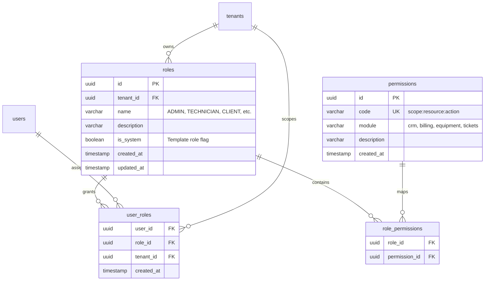
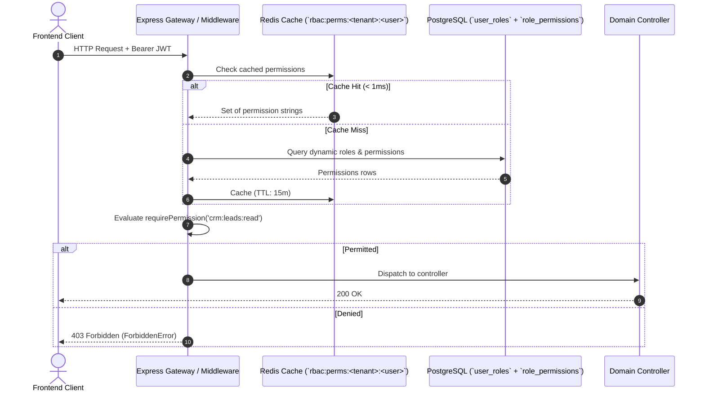

# ADR-014: Dynamic Database-Driven RBAC and Redis-Cached Permission Resolution

## Status
Accepted

## Date
2026-10-06

## Context

Prior to this decision, role-based access control was hardcoded across the codebase:
1. Hardcoded enum checks: Middleware invoked `rbacMiddleware(UserRole.ADMIN)` or checked `req.user.role === 'CLIENT'`.
2. Static identity bounds: Introducing custom tenant roles (e.g., `FACULTY`, `SECURITY_AUDITOR`, `BILLING_ADMIN`) required modifying backend enum definitions, migration scripts, and frontend route guards.
3. Violation of Zero Standing Privileges (ZSP) and Principle of Least Privilege (PoLP): Users were granted monolithic role buckets rather than granular capability permissions (e.g. `crm:leads:read`, `tickets:manage`, `billing:manage`).
4. Hardcoded client-side role guards: Frontend UI elements checked `user.role === 'ADMIN'` instead of asking atomic questions like `can('crm:leads:write')`.

### Requirements
- **Database-Driven Roles & Capabilities**: Store system roles, custom tenant roles, and atomic permissions directly in PostgreSQL relational tables with tenant isolation and Row Level Security (RLS).
- **Sub-Millisecond Authorization**: Permission checking must not add noticeable database latency on hot HTTP API routes.
- **Atomic Capability Routing**: Express 5 route guards must check atomic permissions (`requirePermission('crm:leads:read')` or `requireAnyPermission([...])`) rather than role string literals.
- **Seamless Frontend DX**: A lightweight React hook (`usePermissions()`) providing `can()`, `canAny()`, `canAll()` for conditional rendering and action guards.
- **Backward Compatibility & Graceful Fallback**: Existing users with legacy enum roles (`ADMIN`, `TECHNICIAN`, `CLIENT`) must retain uninterrupted access via baseline capability sets.

---

## Decision

We designed and implemented a full-stack **Dynamic Database-Driven RBAC Engine** backed by PostgreSQL 16 relational tables and Redis-cached capability resolution.

### 1. Relational Schema Architecture (Migration `048`)

Four relational tables model the dynamic authorization graph:



* **Multi-Tenant Isolation**: `roles` and `user_roles` are scoped by `tenant_id`. System roles (`is_system = true`, `tenant_id = NULL`) serve as global templates available to all tenants.
* **Granular Capability Codes**: Structured as `scope:resource:action` (e.g., `crm:leads:read`, `crm:leads:write`, `crm:leads:delete`, `tickets:create`, `tickets:manage`, `billing:manage`, `system:config:write`). Wildcards (`*`, `crm:*`) are natively supported.

### 2. High-Performance Redis-Cached Resolution (`PermissionService`)

To eliminate per-request SQL overhead:
1. When authenticating or processing a request, `PermissionService.getUserPermissions(userId, tenantId)` checks Redis under the key `rbac:perms:<tenantId>:<userId>`.
2. **Cache Hit**: Resolves in $< 1\text{ms}$ returning a `Set<string>`.
3. **Cache Miss**: Queries `user_roles` $\rightarrow$ `role_permissions` $\rightarrow$ `permissions`. The resolved array is cached in Redis with a 15-minute TTL.
4. **Cache Invalidation**: Any assignment, revocation, or role edit immediately invokes `PermissionService.invalidateUserPermissions(userId, tenantId)` and increments `gen:rbac:global`.
5. **Fallback Matrix**: If a user does not have explicit dynamic assignments in `user_roles`, the service falls back to their legacy `user.role` enum (`ADMIN` receives `*`, `TECHNICIAN` receives ticket/equipment capabilities, `CLIENT` receives self-service capabilities).



### 3. Express 5 Route Middleware (`requirePermission`)

Controllers no longer verify role strings. Endpoints declare the exact capabilities they demand:
```typescript
import { requirePermission, requireAnyPermission } from '@shared/middleware/requirePermission';

// Atomic capability requirement
router.get('/leads', requirePermission('crm:leads:read'), controller.getLeads);
router.post('/leads', requirePermission('crm:leads:write'), controller.createLead);
router.delete('/leads/:id', requirePermission('crm:leads:delete'), controller.deleteLead);

// Alternative capability requirement
router.post('/invoices', requireAnyPermission(['invoices:write', 'billing:manage']), controller.createInvoice);
```

### 4. Client-Side Capability Hook (`usePermissions`)

The client receives resolved permissions in JWT payloads and exposes them through `usePermissions()`:
```tsx
import { usePermissions } from '@/hooks/usePermissions';

export function LeadActionsToolbar() {
  const { can, canAny } = usePermissions();

  return (
    <div className="flex gap-2">
      {can('crm:leads:write') && <Button size="sm">New Lead</Button>}
      {can('crm:leads:delete') && <Button variant="destructive" size="sm">Delete</Button>}
    </div>
  );
}
```

---

## Alternatives Considered

1. **Static Roles in Enum (Status Quo)**:
   - Rejected: Rigid, cannot support bespoke tenant requirements (e.g. university faculty vs student delegates), violates PoLP and ZSP.
2. **Pure OAuth2/OIDC Scopes via External IDP (Keycloak / Auth0)**:
   - Rejected: Heavyweight operational overhead for on-premise MSP environments and air-gapped deployments; external network latency on every authorization decision.
3. **Database Queries on Every Request (No Redis Caching)**:
   - Rejected: High database connection pool contention and latency spikes under concurrent dashboard requests. Redis ensures $< 1\text{ms}$ checks.

---

## Consequences

- **Security Posture**: Fully aligns with SOTA Zero Standing Privileges (ZSP) and Principle of Least Privilege (PoLP).
- **Extensibility**: MSP administrators can create custom roles per tenant and fine-tune individual user capabilities through simple database records or API endpoints without code deployments.
- **Maintainability**: Clear boundary separation between authentication (identifying the user) and authorization (verifying capability permissions).
