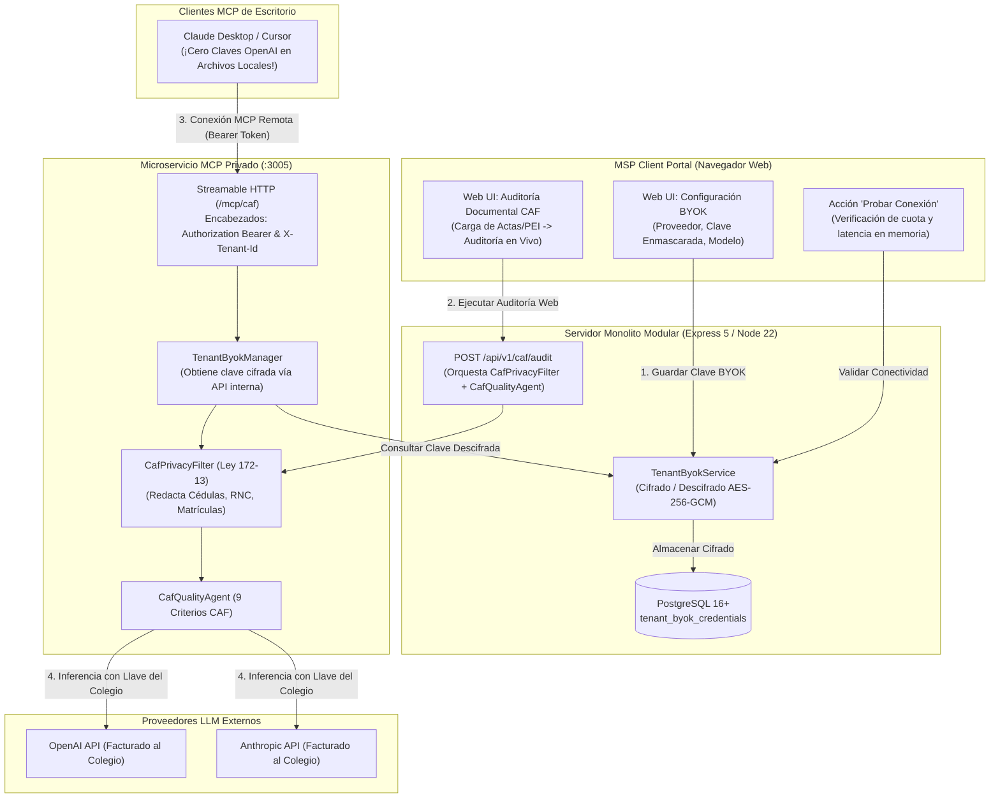

# Web-Native BYOK & CAF Educational AI Portal Integration

## Velmar Technology — AIaaS & School Quality Governance

**Documento de Definición de Producto e Integración Web**  
**Versión:** 1.0.0 | **Fecha:** 2026-09-16 | **Estado:** Aprobado para Planificación Técnica

---

## 1. Problem Statement

> **¿Cómo podríamos permitir que los directores y comités de calidad de los centros educativos configuren, validen y gestionen sus credenciales de IA (BYOK - Bring Your Own Key) directamente desde la interfaz web del portal de clientes de Velmar, eliminando la necesidad de manipular archivos de configuración JSON en sus computadoras y manteniendo la política de cero pasivo financiero para Velmar y el cumplimiento riguroso de la Ley 172-13 de protección de datos?**

---

## 2. Recommended Direction

Implementar una **Arquitectura de Doble Superficie (Dual-Surface BYOK Architecture)** que combina facilidad de uso web para directivos con soporte avanzado para herramientas de escritorio:

1. **Gestión Web Centralizada & Cifrado en Base de Datos:**
   - En la sección de configuración del portal (`Configuración > Inteligencia Artificial & Calidad CAF`), el usuario selecciona su proveedor (OpenAI, Anthropic o Endpoint Local compatible) e introduce su API Key en un campo protegido tipo contraseña.
   - El backend cifra la clave en reposo utilizando **AES-256-GCM** vinculada a la partición del inquilino (`tenant_id`), almacenando únicamente el texto cifrado, el vector de inicialización (`IV`), el tag de autenticación y una máscara segura (`sk-proj...89ab`).
   - Botón interactivo **"Probar Conexión"**: Realiza una verificación en memoria contra el proveedor validando sintaxis, conectividad y cuota disponible en menos de 1,500ms sin persistir secretos en texto plano ni en logs.

2. **Auditoría CAF Directa desde la Web (In-Browser Studio):**
   - Los coordinadores pedagógicos pueden cargar documentos (actas de asamblea, PEI, POA, resultados de pruebas) directamente en el portal web.
   - La interfaz muestra en tiempo real las entidades identificadas y anonimizadas bajo la **Ley No. 172-13** (cédulas, matrículas, nombres, teléfonos dominicanos) antes de enviar la solicitud al agente de calidad, permitiendo ejecutar la auditoría de los 9 criterios del modelo CAF sin instalar software adicional.

3. **Proxy MCP Remoto con Autenticación por Bearer Token (Zero-Secret Desktop Setup):**
   - Para los usuarios avanzados que utilizan **Claude Desktop**, **Cursor** o **Copilot Studio**, el portal genera automáticamente un bloque de configuración JSON pre-autenticado.
   - La configuración apunta al endpoint Streamable HTTP de Velmar (`https://helpdesk.velmartech.com.do/mcp/caf`) utilizando un token de lectura específico del colegio.
   - **Garantía de Seguridad:** Los profesores y directores **nunca** colocan sus llaves maestras de OpenAI o Anthropic en archivos de configuración locales; el servidor MCP de Velmar resuelve la clave cifrada directamente desde el portal bajo demanda y aplica el filtro de privacidad de manera transparente.

---

## 3. Diagrama de Arquitectura del Sistema

---

## 4. Key Assumptions to Validate

- [ ] **Autoservicio en Colegios:** Validar que directores sin perfil técnico puedan generar su API key en OpenAI o Anthropic siguiendo una guía gráfica paso a paso integrada en el portal.
- [ ] **Latencia de Verificación:** Comprobar que el endpoint de validación de credenciales (`/api/v1/tenant/byok/test`) responda en menos de 1,500ms validando acceso a modelos y saldo.
- [ ] **Conexión HTTP Streaming MCP:** Confirmar que los clientes de escritorio (Claude Desktop) admitan encabezados de autenticación HTTP personalizados de forma estable en el transporte Streamable HTTP (especificación MCP 2026-07-28).

---

## 5. MVP Scope

### Componentes Incluidos (Fase 1):

1. **Esquema de Base de Datos (Drizzle ORM):**
   - Tabla `tenant_byok_credentials`:
     - `id`: UUID (Primary Key).
     - `tenant_id`: UUID (Referencia a `tenants.id`, unicidad por inquilino).
     - `provider`: Enum ('openai', 'anthropic', 'custom').
     - `model`: String (ej. `gpt-4o`, `claude-3-5-sonnet-20241022`).
     - `base_url`: String opcional (para servidores locales vLLM u Ollama).
     - `encrypted_api_key`: Text (Payload cifrado).
     - `key_iv`: Varchar(64) (Vector de inicialización hex).
     - `key_auth_tag`: Varchar(64) (GCM auth tag).
     - `key_masked`: Varchar(32) (Muestra `sk-pr...1a2b` para la interfaz).
     - `is_valid`: Boolean (Estado de la última comprobación).
     - `last_tested_at`: Timestamp with timezone.
     - `created_at` / `updated_at`: Timestamps.

2. **Capa de Servicios y Rutas Backend (Express 5):**
   - `PUT /api/v1/tenant/byok`: Guarda y cifra la clave del colegio bajo aislamiento estricto de inquilino.
   - `POST /api/v1/tenant/byok/test`: Ejecuta comprobación en vivo con el proveedor externo sin registrar el secreto en logs.
   - `GET /api/v1/tenant/byok/status`: Retorna el estado público/enmascarado para la UI.
   - `GET /api/v1/internal/byok/:tenantId`: Endpoint autenticado mediante `MSP_API_KEY` para que el servidor MCP consulte credenciales dinámicas en tiempo de ejecución.
   - `POST /api/v1/caf/audit`: Endpoint web para auditar documentos escolares directamente desde el portal.

3. **Interfaz de Usuario Web (`client/src/features/settings`):**
   - Tarjeta interactiva con selectores de proveedor, entrada segura de clave (con botón para mostrar/ocultar), selector de modelo y botón **"Probar Conexión"**.
   - Indicador visual de estado (`Conectado y Listo`, `Clave Inválida`, `Pendiente de Configuración`).
   - Pestaña / Modal auxiliar **"Conectar con Claude Desktop"** que muestra el fragmento JSON listo para copiar con un solo clic.

4. **Sincronización en `packages/mcp-server`:**
   - Actualización de `TenantByokManager` para consultar en memoria con fallback automático al backend (`MspApiClient`) cuando se recibe una solicitud con `tenantId` que aún no está en caché volátil.

---

## 6. Not Doing (and Why)

- **Reventa o Billetera de Tokens de Velmar:** Excluido del MVP para mantener la garantía estricta de **Cero Responsabilidad Financiera (Zero-Liability)** y evitar temas de facturación compleja de micro-tokens o retenciones de impuestos en reventa.
- **Almacenamiento Local en Texto Plano (`localStorage`):** Prohibido por seguridad, ya que los directores y docentes suelen compartir equipos en oficinas escolares o salas de profesores.
- **OCR para Documentos Escaneados a Mano:** En el MVP los documentos deben ser texto digital (DOCX, TXT o PDF con capa de texto). El OCR pesado se reserva para la Fase 2.

---

## 7. Open Questions para la Implementación

1. ¿El acceso a la auditoría CAF en la web debe estar dentro de `Configuración > Inteligencia Artificial` o recibir un enlace dedicado en la barra lateral (`Calidad Educativa CAF`) para colegios que contraten el plan de calidad?
2. ¿Deseamos que el endpoint de validación (`/test`) consuma intencionalmente 1 token real de prueba (ej. llamada a `models.list` o un prompt mínimo de 1 palabra) para certificar que la cuenta del colegio tiene saldo positivo activo?
