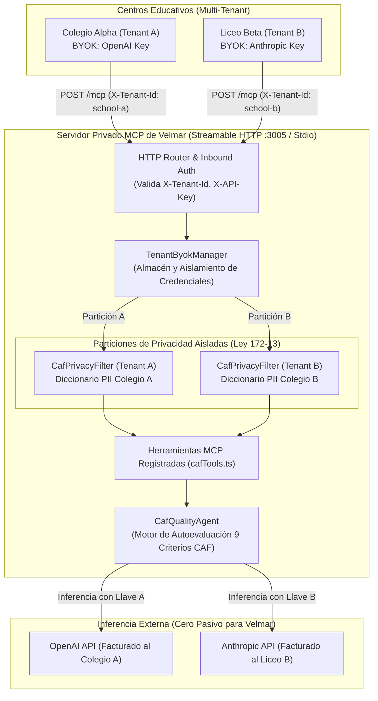

# CAF Educational Quality Agent & Private Multi-Tenant MCP Service (BYOK)
## Velmar Technology — AIaaS (AI-as-a-Service) para Centros Educativos

**Documento Estratégico, Arquitectura Técnica y Manual de Operación**  
**Versión:** 1.0.0 | **Fecha:** 2026-09-15 | **Estado:** Implementado y Verificado (Production-Ready)

---

## 1. Resumen Ejecutivo & Estrategia Comercial

### 1.1 El Salto de Negocio para Velmar Technology
Tradicionalmente, Velmar Technology opera como un Proveedor de Servicios Gestionados (MSP) enfocado en infraestructura física, redes, soporte IT y licenciamiento. Esta iniciativa permite evolucionar hacia **Servicios Gestionados de Inteligencia Artificial (AIaaS)** de alto margen recurrente (MRR), posicionando a Velmar como un socio estratégico de gobernanza y acreditación para instituciones educativas.

### 1.2 El Problema del Cliente (Pain Point)
* **Parálisis Burocrática CAF:** En el sector educativo (República Dominicana y LATAM), la autoevaluación bajo el **Marco Común de Evaluación (CAF / Common Assessment Framework)** o normativas de calidad (MINERD / ISO 9001) exige más de **300 horas-persona** por ciclo. Los comités de calidad pierden meses buscando actas, consolidando encuestas de satisfacción y redactando el Plan de Mejora Institucional (PMI).
* **Riesgo de Privacidad (Ley 172-13):** Las escuelas no pueden utilizar modelos públicos de IA (ej. ChatGPT comercial) debido a la exposición de datos sensibles de menores (cédulas, notas, quejas, matrículas).

### 1.3 La Solución: Agente CAF con Proxy MCP Privado
Velmar despliega un **Agente Autónomo de Calidad Educativa** respaldado por un servidor privado de **Model Context Protocol (MCP)** alojado en su infraestructura privada (Velmar Cloud / VPS).
* **Automatización del 80%** del trabajo burocrático de auditoría de evidencias y encuestas.
* **Anonimización In-Memory previa:** Cumplimiento total de la Ley 172-13 de Protección de Datos Personales.
* **Arquitectura BYOK (Bring Your Own Key):** Las instituciones aportan sus propias credenciales de OpenAI o Anthropic, eliminando el pasivo financiero de consumo de tokens para Velmar.

### 1.4 Modelo Económico y Reparto de Ingresos

| Componente del Servicio | Qué vende Velmar al Colegio | Esquema de Reparto |
| :--- | :--- | :---: |
| **Implementación & Integración** | Onboarding, configuración del entorno seguro y conexión a repositorios de evidencias (Nextcloud / ERP). | **70% Velmar / 30% Proveedor** |
| **Suscripción Mensual (SaaS + SLA)** | Licencia del Agente CAF, actualizaciones del protocolo MCP y soporte técnico L1. | **50% Velmar / 50% Proveedor** |
| **Alojamiento & Privacidad Local** | Gestión del servidor MCP seguro y almacenamiento cifrado de evidencias. | **100% Velmar** |

#### Proyección Económica (Portafolio de 10 Colegios Privados):
* **Tarifa Setup:** $1,000 USD por centro educativo.
* **Cuota Recurrente:** $200 USD/mes de suscripción + $50 USD/mes de hosting seguro = **$250 USD/mes/colegio**.
* **Impacto Anual para Velmar:**
  * Setup inicial: **$7,000 USD**
  * MRR recurrente: **$1,500 USD/mes ($18,000 USD/año)**
* **Impacto Anual para el Proveedor:**
  * Setup inicial: **$3,000 USD**
  * MRR recurrente: **$1,000 USD/mes ($12,000 USD/año)**

---

## 2. Marco Legal Dominicano (Ley 172-13)

La **Ley No. 172-13** tiene por objeto la protección integral de los datos personales asentados en archivos, registros o bancos de datos. En centros educativos, la información de estudiantes menores de edad posee categoría de máxima protección.

### Garantía Técnica Implementada:
1. **Anonimización Local en Memoria (`CafPrivacyFilter`):** Antes de que cualquier texto sea enviado a la API del LLM externo (OpenAI/Anthropic), el proxy local reemplaza de forma determinista y segura:
   * **Cédulas y RNC:** `001-1234567-8` $\rightarrow$ `[CEDULA_01]`
   * **Matrículas Escolares:** `2024-0891`, `MAT-4491` $\rightarrow$ `[MATRICULA_01]`
   * **Correos Electrónicos:** `alumno@colegio.edu.do` $\rightarrow$ `[EMAIL_01]`
   * **Teléfonos Dominicanos:** `809-555-1234` $\rightarrow$ `[TELEFONO_01]`
   * **Nombres Contextuales de Estudiantes y Profesores:** `Estudiante Carlos Peña` $\rightarrow$ `Estudiante [ESTUDIANTE_01]`
2. **Des-anonimización Local Segura:** La tabla de correspondencia reside exclusivamente en la memoria volátil del servidor del colegio. El informe final solo se restaura localmente cuando el personal directivo autorizado lo solicita (`preservePiiLocally: true`).

---

## 3. Arquitectura del Sistema



---

## 4. Módulos y Código Fuente Implementado

Los componentes residen en el paquete `packages/mcp-server`:

### 4.1 Cliente LLM BYOK (`src/byok/ByokLlmClient.ts`)
* **Propósito:** Abstracción unificada para OpenAI, Anthropic y endpoints compatibles (DeepSeek, OpenRouter, vLLM/Ollama).
* **Garantía Zero-Liability:** Lanza `ByokKeyMissingError` (HTTP 401) si no se provee una clave válida por parámetro, encabezado HTTP (`X-BYOK-Api-Key`) o variable de entorno (`BYOK_DEFAULT_API_KEY`).
* **Retorno:** Contenido generado, modelo ejecutado y telemetría de tokens consumidos.

### 4.2 Filtro de Privacidad (`src/caf/CafPrivacyFilter.ts`)
* **Propósito:** Detección heurística y por expresiones regulares de entidades sensibles en textos pedagógicos, actas y encuestas.
* **Métodos Principales:**
  * `anonymize(text, existingMapping)`: Retorna texto sanitizado, conteo de entidades y diccionario de mapeo.
  * `deanonymize(text, mapping)`: Reemplaza los tokens de privacidad por sus valores originales en entornos locales autorizados.

### 4.3 Gestor Multi-Tenant (`src/byok/TenantByokManager.ts`)
* **Propósito:** Administración de inquilinos en memoria con particionamiento de credenciales y diccionarios de privacidad.
* **Garantías de Aislamiento:**
  * `setTenantProfile()` / `getTenantProfile()`: Asocia cada `tenantId` a su proveedor y clave de API.
  * `getTenantPrivacyFilter(tenantId)`: Instancia un filtro independiente por colegio, evitando colisiones entre expedientes de distintos centros.
  * `getTenantStatus(tenantId)`: Expone estado y máscara de llave (`sk-pr...2345`) sin revelar secretos.

### 4.4 Agente de Calidad Educativa (`src/caf/CafQualityAgent.ts`)
Implementa los **9 Criterios del Marco Común de Evaluación (CAF)**:
1. **Criterio 1 (Liderazgo):** Dirección estratégica, ética y gobernanza institucional.
2. **Criterio 2 (Estrategia y Planificación):** Plan Estratégico (PEI), POA y alineación curricular.
3. **Criterio 3 (Personas):** Gestión del talento docente, formación continua y clima laboral.
4. **Criterio 4 (Alianzas y Recursos):** Infraestructura TI, laboratorios y presupuesto.
5. **Criterio 5 (Procesos):** Diseño pedagógico, gestión académica y mejora continua.
6. **Criterio 6 (Resultados en Alumnos y Familias):** Percepción, convivencia escolar y satisfacción.
7. **Criterio 7 (Resultados en el Personal):** Satisfacción del equipo docente y administrativo.
8. **Criterio 8 (Resultados en la Sociedad):** Impacto comunitario y responsabilidad social.
9. **Criterio 9 (Resultados Clave):** Tasas de promoción, pruebas nacionales y eficiencia operativa.

**Flujos de Trabajo del Agente:**
* `auditEvidence()`: Audita evidencias documentales, calcula puntajes (0-100), grado (A–F), brechas y matriz FODA.
* `analyzeSurveySentiment()`: Análisis psicométrico y cuantitativo de encuestas comunitarias (impacto en Criterios 6 y 7).
* `generateImprovementPlan()`: Síntesis automática del **Plan de Mejora Institucional (PMI)** con acciones SMART, indicadores KPI, plazos y roles responsables.

### 4.5 Herramientas MCP Privadas (`src/tools/cafTools.ts`)
Registradas sobre la instancia de `McpServer`:

| Nombre de la Herramienta | Parámetros Principales | Descripción |
| :--- | :--- | :--- |
| `caf_configure_tenant_byok` | `tenantId`, `provider`, `apiKey`, `model`, `institutionName` | Onboarding o actualización de credenciales BYOK del colegio. |
| `caf_get_tenant_byok_status` | `tenantId` | Consulta de estado de configuración y privacidad del colegio. |
| `caf_audit_evidence` | `documentText`, `tenantId`, `criteriaFilter`, `dryRun` | Auditoría integral contra los 9 criterios del modelo CAF. |
| `caf_analyze_survey_sentiment` | `surveys` (array), `tenantId`, `dryRun` | Evaluación psicométrica de encuestas comunitarias. |
| `caf_detect_documentary_gaps` | `documentText`, `tenantId`, `dryRun` | Extracción de omisiones y no conformidades documentales. |
| `caf_generate_improvement_plan` | `auditReport`, `targetYear`, `tenantId`, `dryRun` | Generación del Plan de Mejora Institucional (PMI). |
| `caf_anonymize_text` | `text`, `tenantId` | Verificación interactiva de sanitización según Ley 172-13. |

---

## 5. Guía de Despliegue y Puesta en Producción

### Opción A: Despliegue como Servicio HTTP Privado
1. Configurar variables en `packages/mcp-server/.env`:
   ```env
   MCP_TRANSPORT=http
   MCP_HTTP_PORT=3005
   MCP_REQUIRE_AUTH=true
   MCP_SERVER_API_KEY=velmar-mcp-secret-production-key
   MSP_API_URL=https://api.velmartech.com.do/api/v1
   MSP_API_KEY=velmar-system-token
   ```
2. Iniciar el servicio en el servidor de Velmar:
   ```bash
   npm -w packages/mcp-server run start:http
   ```
3. Endpoint expuesto: `https://mcp.velmartech.com.do/mcp` (con autenticación por encabezado `X-API-Key`).

### Opción B: Integración con Clientes de Escritorio (Claude Desktop / Cursor / IDE)
En el archivo de configuración MCP (`claude_desktop_config.json`):
```json
{
  "mcpServers": {
    "caf-quality-agent": {
      "command": "node",
      "args": [
        "C:/Users/PC/Workspace/msp_client_portal/packages/mcp-server/dist/index.js"
      ],
      "env": {
        "MSP_API_URL": "http://localhost:3000/api/v1",
        "MSP_API_KEY": "velmar-api-token",
        "BYOK_DEFAULT_API_KEY": "sk-proj-tu-llave-openai-o-anthropic"
      }
    }
  }
}
```

### Opción C: Despliegue con Docker (Portainer)
```bash
docker build -t velmar/caf-mcp-service:latest -f packages/mcp-server/Dockerfile .
docker run -d \
  --name velmar-caf-mcp \
  -p 3005:3005 \
  -e MCP_TRANSPORT=http \
  -e MCP_HTTP_PORT=3005 \
  -e MCP_SERVER_API_KEY=velmar-mcp-secret \
  -e MSP_API_URL=https://api.velmartech.com.do/api/v1 \
  -e MSP_API_KEY=velmar-token \
  velmar/caf-mcp-service:latest
```

---

## 6. Verificación, Pruebas y Validación

### 6.1 Resultados de la Suite Automatizada (Vitest)
Ejecutado con: `npm -w packages/mcp-server run test`
* **Test Files:** 3/3 pasados.
* **Total Tests:** 51/51 pasados (100% verde).
* **Cobertura CAF & Multi-Tenant:**
  * Sanitización y des-anonimización de PII bajo Ley 172-13.
  * Manejo estricto de error `ByokKeyMissingError` ante ausencia de clave.
  * Auditoría determinista en los 9 criterios y filtrado selectivo.
  * Análisis psicométrico de encuestas y cálculo de impacto en Criterios 6 y 7.
  * Generación del Plan de Mejora Institucional (PMI) estructurado.
  * Aislamiento de perfiles y particiones de privacidad entre múltiples colegios.
  * Inferencia simulada de llamadas LLM de OpenAI y Anthropic.

### 6.2 Demostración Interactiva en CLI
Ejecutable en cualquier momento con:
```bash
npx tsx packages/mcp-server/scripts/runCafQualityAgent.ts
```
* **Resultado del Script:** Redacta 11 entidades de PII simuladas de un centro educativo dominicano, evalúa los 9 criterios (Puntaje: 73/100, Grado C), procesa encuestas (75% satisfacción) y sintetiza el plan de acción `PMI-2026.1`.

---

## 7. Próximos Pasos Comerciales (Kit de Venta para Velmar)

1. **Calculadora de ROI:** Documentar para directores escolares el ahorro de más de 250 horas docentes por ciclo de evaluación (equivalente a $3,500–$6,000 USD en horas extras o consultorías externas).
2. **Piloto Controlado:** Implementar el primer centro piloto utilizando la infraestructura de almacenamiento Nextcloud de Velmar junto con el servidor MCP en modo HTTP.
3. **Integración con el Portal:** Añadir en el menú de clientes de `msp_client_portal` la pestaña "Auditoría CAF e IA Educativa" vinculada a las credenciales del colegio.
