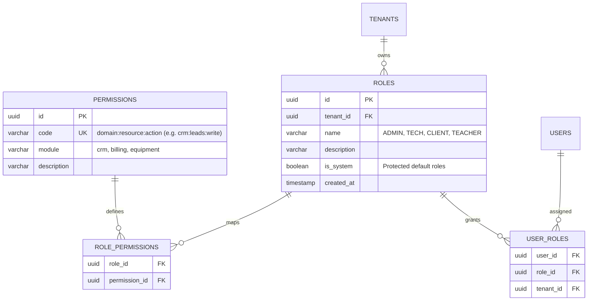
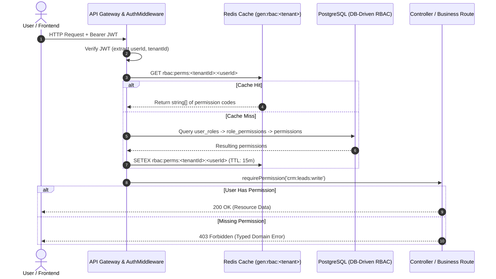

# Architecture Blueprint: Dynamic DB-Driven RBAC & Permissions Engine

## 1. Problem Statement & Motivation
Currently, user roles and types are hardcoded in:
- Database Enums & Columns: `userRoleEnum('role')` (`'CLIENT'`, `'TECHNICIAN'`, `'ADMIN'`), `client_type` (`'CLIENT'`, `'ENTERPRISE'`, `'STUDENT'`).
- Route Middlewares: `rbacMiddleware(UserRole.ADMIN)`.
- Client Guards: checking literal string roles rather than atomic capabilities.

**Objective**: Eliminate hardcoded role strings and user types from business routes and frontend checks. Delegate authorization to dynamic database entities (`roles`, `permissions`, `role_permissions`, `user_roles`) resolved via Redis caching and evaluated using capability-based permissions (e.g. `users:read`, `tickets:manage`, `crm:leads:create`).

---

## 2. Database Schema Design (Pure Relational RBAC)



---

## 3. High-Performance Runtime Resolution & Caching Strategy



---

## 4. Replacement Pattern: From Static Enum to Dynamic Capability

### Before (Hardcoded Role Guard):
```typescript
// ❌ Rigid, breaks when adding a new user type like 'TEACHER' or 'AUDITOR'
router.get('/leads', rbacMiddleware(UserRole.ADMIN), crmController.getLeads);
```

### After (Dynamic Capability Guard):
```typescript
// ✅ Flexible: Any role assigned 'crm:leads:read' in the DB can access this route
router.get('/leads', requirePermission('crm:leads:read'), crmController.getLeads);
```

### In Frontend UI:
```tsx
// ❌ Before
{user.role === 'ADMIN' && <NewLeadButton />}

// ✅ After
const { can } = usePermissions();
{can('crm:leads:write') && <NewLeadButton />}
```

---

## 5. Phased Migration Plan (Zero-Downtime)

1. **Phase 1: DB Migration**:
   - Create tables `roles`, `permissions`, `role_permissions`, and `user_roles`.
   - Seed baseline system roles (`ADMIN`, `TECHNICIAN`, `CLIENT`) and standard permission codes.
   - Run data backfill script linking all existing users in `users.role` to their corresponding `user_roles` records.
2. **Phase 2: Redis-Backed Permission Resolution**:
   - Create `PermissionService` & `requirePermission(...)` middleware.
   - Attach resolved `req.user.permissions: string[]` to Express request context.
3. **Phase 3: Route Refactor**:
   - Incrementally replace `rbacMiddleware(UserRole.X)` across domains (`crm`, `billing`, `equipment`, `tickets`).
4. **Phase 4: Dynamic Admin UI**:
   - Implement Role & Permission Management page in the settings module, allowing admins to create custom roles (e.g., "Coordinador Docente", "Auditor Externo") and assign permissions entirely through UI & DB.
