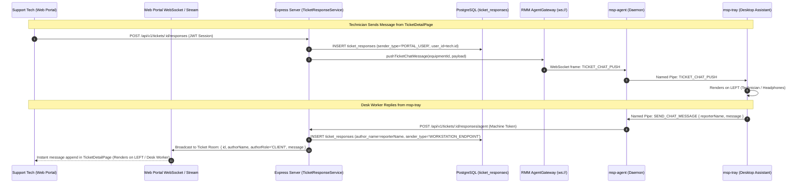

# Realtime Ticket Chat & Identity Sync Architecture

**Date:** 2026-09-10  
**Status:** PROPOSED  
**Owners:** Architecture Team / Support Engineering  
**Scope:** `server` (WebSocket Gateway & Ticketing), `client` (`TicketDetailPage`), `packages/msp-agent`, `packages/msp-tray`

---

## 1. Problem Statement

How might we deliver instant, bidirectional, zero-latency chat communication between web technicians in `TicketDetailPage` and physical desk users in `msp-tray`, while establishing an unmistakable, un-swappable conversational identity model across the database, gateway, and both UI views?

### Observed Breakdowns:
1. **Asymmetric Realtime Transport:**
   - `AgentGateway` pushes live WebSocket events (`TICKET_CHAT_PUSH`) exclusively to remote workstation daemons (`msp-agent`), which forwards them to `msp-tray`.
   - The web frontend (`client/src/features/tickets/pages/TicketDetailPage.tsx`) has zero WebSocket or real-time event subscription mounted. It only fetches responses once on initial mount, requiring manual browser reloads to see desk worker replies.
2. **Identity Swapping & Role Conflation:**
   - `TicketResponseRepository.create` dropped the `author_name` parameter during SQL insertion, and `findByTicket` never selected `author_name` from the `ticket_responses` table.
   - Endpoint responses were stored with `user_id = agent.clientId`. When queried, the author defaulted to the client owner's user account in the database (often an Admin or Tech account in staging/testing).
   - In `msp-tray`, messages with non-CLIENT roles inverted their alignment to the technician's side (left), causing desk users' own messages to appear as incoming replies.
   - In `TicketDetailPage.tsx`, messages from the desk worker matched the logged-in client user ID and lacked `author_name`, causing them to render on the right as "Self".

---

## 2. Target Architecture

---

## 3. Core Decisions & Contracts

### A. Database & Repository Fixes
1. **Schema & Repository Alignment:**
   - Update [`TicketResponseRepository.create`](file:///c:/Users/PC/Workspace/msp_client_portal/server/src/modules/tickets/repositories/TicketResponseRepository.ts) to explicitly insert `author_name`.
   - Update [`TicketResponseRepository.findByTicket`](file:///c:/Users/PC/Workspace/msp_client_portal/server/src/modules/tickets/repositories/TicketResponseRepository.ts) to select `ticketResponses.author_name`.
   - Add explicit `sender_type` (`'PORTAL_USER' | 'WORKSTATION_ENDPOINT'`) to `ticket_responses` to permanently eliminate role ambiguity.

### B. Bi-Directional Realtime Gateway
1. **Web Portal WebSocket Integration:**
   - Mount a ticket notification namespace or WebSocket room handler on the server (e.g. `/ws/tickets` or via `AgentGateway` client connection channel).
   - In `client`, implement `useTicketChatStream(ticketId)`:
     - Connects on ticket detail mount, subscribes to `ticket:<id>`.
     - Automatically updates the local TanStack query cache / responses state upon message arrival.
     - Includes automatic reconnection and a 5s fallback polling heartbeat.
2. **Desk Tray Companion Sync:**
   - In `LiveChatDrawer.tsx`, retain the immediate `ticket_chat_push` listener while adding a 3s background polling fallback to guarantee delivery if the endpoint WebSocket temporarily flaps.

### C. Visual Identity & Alignment Rule

| Context | Desk Worker Message | Support Technician Message |
| :--- | :--- | :--- |
| **Web Portal (`TicketDetailPage`)** | **LEFT** (Avatar: Worker Initials, Badge: `[ENDPOINT: Desk Worker]`, Role: `CLIENT`) | **RIGHT** (Avatar: Tech Initials, Bubble: Primary Blue `isSelf`, Role: `TECH/ADMIN`) |
| **Desktop Tray (`msp-tray`)** | **RIGHT** (Avatar: `UserCheck` Orange, "You", Sent Bubble) | **LEFT** (Avatar: `Headphones` Blue, Tech Name, Support Bubble) |

---

## 4. MVP Scope & Boundaries

### In-Scope (MVP):
1. Fix `TicketResponseRepository` dropping `author_name` on insert and select.
2. Ensure `getResponsesForAgent` strictly marks endpoint-authored responses as `CLIENT` and technician responses as `TECHNICIAN`.
3. Provide real-time WebSocket push from backend to `TicketDetailPage` so technician sees desk user replies without refreshing.
4. Add background refresh / reconciliation to `msp-tray` to avoid missed messages during socket reconnection.
5. Invert alignment rules correctly in both UIs.

### Out of Scope (Not Doing):
1. Voice/Video streaming or screen sharing.
2. Read receipts ("seen at") and typing bubbles (reserved for v2.0).
3. Modifying the physical named pipe protocol framing.
