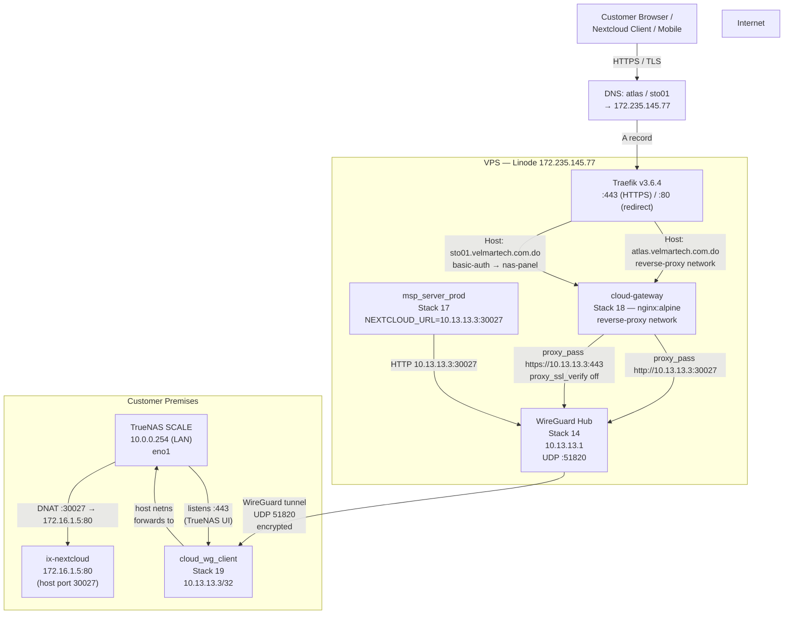
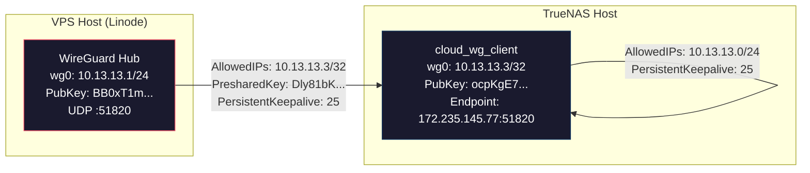

# Infrastructure Specification: Velmar MSP ↔ TrueNAS/Nextcloud WireGuard Integration

_Status: Deployed & Active · Last Verified: 2026-08-25 · Version: 2.0_

---

## 1. Executive Summary & Business Context

### Project Overview

The MSP Client Portal provides automated cloud storage provisioning and backup quotas (25 GB per device slot) to clients via an external **Nextcloud** instance running on **TrueNAS SCALE** (`cloud-storage-srv-1`). The customer TrueNAS environment sits behind a **dynamic WAN IP** (`64.32.126.122`, subject to ISP renewal) with no public port forwards exposed on customer perimeter firewalls.

A persistent **WireGuard Site-to-Client Tunnel** connects the helpdesk VPS hub with the TrueNAS host, establishing a stable `10.13.13.0/24` transit network immune to dynamic IP changes. Public-facing services are reverse-proxied through the VPS using **Traefik v3.6.4** with automatic Let's Encrypt TLS certificate issuance.

### Business Objectives

| # | Objective | Implementation |
|---|---|---|
| 1 | **Internal Application Access** | Backend container `msp_server_prod` executes WebDAV provisioning and OCS user administration against Nextcloud over private IP `10.13.13.3:30027` |
| 2 | **Customer Remote Access** | Nextcloud published at `https://atlas.velmartech.com.do` via Traefik reverse proxy routed through the WireGuard tunnel |
| 3 | **Admin Panel Access** | TrueNAS management UI published at `https://sto01.velmartech.com.do` behind HTTP Basic Auth gate, routed through the same tunnel to `10.13.13.3:443` |
| 4 | **Resilience** | Immune to dynamic ISP WAN/LAN address renewals and customer NAT state changes; persistent default route survives TrueNAS reboots |

### Design Principles Applied

- **Defense in Depth**: Basic-auth gate on admin panel + TrueNAS login + recommended 2FA
- **ITIL Naming Convention**: Hostnames follow `<class><nn>` pattern (`sto01`, future: `app01`, `mon01`) — no functional names that reveal service identity to external observers
- **Zero Trust for Admin Surfaces**: Panel requires authentication before reaching TrueNAS; not discoverable via CT logs under functional names

---

## 2. Layer 3 Network Topology

### 2.1 Full Path Diagram



### 2.2 WireGuard Tunnel Detail



---

## 3. IP Schema, Port Mapping & Credentials Matrix

### 3.1 IP Allocation Table

| Node | Interface / Role | IP Address | Subnet / Scope | Gateway | Notes |
|---|---|---|---|---|---|
| **Helpdesk VPS (Linode)** | `eth0` (WAN) | `172.235.145.77` | Public WAN | `172.235.145.1` | Traefik entrypoint (:443, :80, :9443) |
| **WireGuard Hub** | `wg0` (Hub) | `10.13.13.1` | `10.13.13.0/24` | — | `network_mode: host`, UDP :51820 |
| **Road Warrior Peer** | `wg0` (mypcs) | `10.13.13.2/32` | `/32` | — | Administrative access peer |
| **TrueNAS SCALE Host** | `wg0` (cloud-wg) | `10.13.13.3/32` | `/32` | — | Container `cloud_wg_client` in host netns |
| **TrueNAS SCALE Host** | `eno1` (LAN) | `10.0.0.254` | `10.0.0.0/24` | `10.0.0.1` | DHCP + persistent static route |
| **Nextcloud Container** | `ix-nextcloud` | `172.16.1.5` | Docker bridge | — | Published to host port `:30027` |

### 3.2 Public DNS & Service Routing

| Hostname | Record | Target | Service | Auth |
|---|---|---|---|---|
| `atlas.velmartech.com.do` | A | `172.235.145.77` | Nextcloud (WebDAV, UI) | Nextcloud login |
| `sto01.velmartech.com.do` | A | `172.235.145.77` | TrueNAS Admin Panel | Basic-auth + TrueNAS login |
| `helpdesk.velmartech.com.do` | CNAME | `proxy.local` → `172.235.145.77` | Portainer CE :9443 | Portainer auth |

### 3.3 Port Mapping & Proxy Chain

| Port | Protocol | Location | Purpose | Proxy Path |
|---|---|---|---|---|
| `51820` | UDP | VPS ↔ NAS | WireGuard tunnel | Direct (host netns) |
| `443` | TCP | VPS (Traefik) | Public HTTPS ingress | Traefik → nginx gateway → tunnel → NAS |
| `80` | TCP | VPS (Traefik) | HTTP → HTTPS redirect | Traefik (auto-redirect) |
| `9443` | TCP | VPS | Portainer management UI | Direct |
| `30027` | TCP | NAS host | Nextcloud HTTP (Docker) | Host port → `172.16.1.5:80` (DNAT) |
| `443` | TCP | NAS host | TrueNAS Web UI | `10.13.13.3:443` → nginx → NAS |

### 3.4 Credentials Reference

> ⚠️ **SENSITIVE** — Rotate after engagement. Never commit to version control.

| System | Credential | Value |
|---|---|---|
| **Portainer CE** | API Key | `ptr_W8K+C6lIaqSa5LrLavyEvoMpyJ8DiqKDQpmhE+xdU+k=` |
| **Portainer CE** | URL | `https://helpdesk.velmartech.com.do:9443` |
| **TrueNAS SSH** | User / Password | `truenas_admin` / `UlFZe8z9kac9diNE` |
| **TrueNAS Panel** | User / Password | `velmar-admin` / `Zw9yfJXEZxYWNGItTFKr` |
| **TrueNAS Panel** | Basic-Auth Hash (APR1) | `$apr1$0aefa95e$cSMSryJpKHZQnRlIuXDQc/` |
| **Nextcloud App** | User / Password | `msp_client_portal` / `NZP23-BW4kX-F6SK4-qBeRj-TQPg5` |
| **WireGuard Hub** | Public Key | `BB0xT1mJifO0Yc2MYr1uY+ilZGXntgts1vK7tbJUO1E=` |
| **WireGuard NAS** | Private Key | `wIdkL1oG876lv+a6xh8P/FCzZ1e28ZAsx1ra1sBxVH4=` |
| **WireGuard NAS** | Public Key | `ocpKgE7m8PLQoMPmOaGJPP/cf2vIX++pusy9Ewu12Bs=` |
| **WireGuard NAS** | PresharedKey | `Dly81bKLu2uFixYM3jeH40OXLLr8IGzlyu0OkTTnQ4M=` |

---

## 4. Portainer Environment & Deployed Stacks

### 4.1 Endpoints

| Endpoint ID | Name | Type | Host | Network |
|---|---|---|---|---|
| **3** | `local` | Standalone Docker | Linode VPS (`172.235.145.77`) | eth0: WAN |
| **4** | `cloud-storage-srv-1` | Edge Agent | TrueNAS SCALE (`10.0.0.254`) | eno1: LAN |

### 4.2 Stack Inventory

| Stack ID | Name | Endpoint | Image | Purpose |
|---|---|---|---|---|
| **3** | `traefik` | 3 | `traefik:v3.6.4` | Reverse proxy, TLS termination, Let's Encrypt |
| **14** | `wireguard` | 3 | `linuxserver/wireguard:latest` | WireGuard hub (host netns) |
| **17** | `msp_portal` | 3 | 12-service Compose stack | MSP backend + client, PostgreSQL, Zabbix observability, Dozzle, Prometheus/Grafana, Faro/Alloy (`NEXTCLOUD_URL=10.13.13.3:30027`) → see §4.4 |
| **18** | `cloud-gateway` | 3 | `nginx:alpine` | Dual nginx proxy (Nextcloud + TrueNAS panel) |
| **19** | `cloud-wg` | 4 | `linuxserver/wireguard:latest` | WireGuard client on TrueNAS (host netns) |

### 4.3 Stack 18 — cloud-gateway (Detailed)

This stack defines **two nginx server blocks** on a single container, each fronted by a dedicated Traefik router with explicit `.service=` binding:

**Server Block 1 — Nextcloud (`atlas.velmartech.com.do`)**
- `proxy_pass http://10.13.13.3:30027` (plain HTTP to Nextcloud)
- `client_max_body_size 0` (unlimited uploads)
- `proxy_request_buffering off` (streaming large files)
- CalDAV/CardDAV well-known redirects
- WebSocket upgrade support

**Server Block 2 — TrueNAS Panel (`sto01.velmartech.com.do`)**
- `proxy_pass https://10.13.13.3:443` (HTTPS to TrueNAS UI)
- `proxy_ssl_verify off` (TrueNAS uses self-signed/internal cert)
- `proxy_redirect` rewrites (`10.13.13.3` → `$host`)
- WebSocket upgrade support
- **Basic-auth gate** enforced at Traefik layer (not nginx)

**Traefik Labels (critical)**
```yaml
# Multi-service binding — REQUIRED when one container defines multiple routers
traefik.http.routers.nextcloud-cloud.service=nextcloud-cloud
traefik.http.routers.nas-panel.service=nas-panel

# Basic-auth middleware for panel
traefik.http.middlewares.nas-auth.basicauth.users=velmar-admin:$$apr1$$0aefa95e$$cSMSryJpKHZQnRlIuXDQc/
traefik.http.routers.nas-panel.middlewares=nas-auth
```

> ⚠️ **Known Traefik Gotcha**: When a single container defines multiple routers/services, every router MUST have an explicit `.service=` binding label. Without it, Traefik cannot auto-link and disables all routers on that container.

### 4.4 Stack 17 — msp_portal (Deep Dive Pointer)

The **`msp_portal`** stack hosts the entire MSP Client Portal plus its observability suite (see the full specification in [`MSP_PORTAL_STACK.md`](MSP_PORTAL_STACK.md)):

- **Application:** `db` (PostgreSQL 16) + `server` (`ghcr.io/velmar-technology/msp-services-server:<VERSION>`, port 3001, `NEXTCLOUD_URL=10.13.13.3:30027`) + `client` (nginx SPA, catch-all route).
- **Zabbix monitoring:** `zabbix-db`, `zabbix-server` (published `:10051`), `zabbix-web` (nginx frontend, exposed at `https://helpdesk.velmartech.com.do/zabbix/` behind basic-auth) and `zabbix-agent` (agent2, shares the server netns).
- **Telemetry / hygiene:** `logs` (Dozzle, `/logs`), `prometheus` (`v2.54.0`, `/prometheus`, scrapes `traefik:8080`, `alloy:12345`, `server:3001/api/v1/metrics`), `alloy` (Faro receiver, `/collect`), `grafana` (`/grafana/`, Zabbix app plugin preinstalled).
- **2026-08-27 zabbix fix:** `/zabbix` route previously 404'd because the Zabbix nginx serves only at `/`. Traefik now redirects `/zabbix` → `/zabbix/` and strips the prefix via `msp-zabbix-redirect` + `msp-zabbix-strip` (labels on `zabbix-web`). Detail in §5 of `MSP_PORTAL_STACK.md`.
- **Deployment:** CI pipeline (`deploy.yml`)/redeploy scripts push the repo-owned `docker-compose.prod.yml` to Portainer with a pinned `VERSION`; rollback = re-pin previous tag.

---

## 5. Nextcloud Configuration

Applied via `occ` commands inside container `ix-nextcloud-nextcloud-1` on endpoint 4:

```bash
# trusted_domains (index 5 updated from cloud.* → atlas.*)
trusted_domains:
  - 0: 10.0.0.254
  - 1: 127.0.0.1
  - 2: 190.80.130.192     # legacy, dead path
  - 3: localhost
  - 4: nextcloud
  - 5: atlas.velmartech.com.do
  - 6: 10.13.13.3

trusted_proxies:
  - 10.13.13.1            # WireGuard hub (VPS host netns)

overwrite.cli.url: https://atlas.velmartech.com.do
overwriteprotocol: https
```

---

## 6. Persistent Route & Durability

### 6.1 Problem

TrueNAS SCALE uses DHCP for `eno1` with no guaranteed default route persistence. If the DHCP lease renews without a gateway option, the default route is lost — breaking all outbound connectivity including the WireGuard tunnel's return path.

### 6.2 Solution

A systemd service ensures the default route exists at every boot:

```ini
# /etc/systemd/system/velmar-default-route.service
[Unit]
Description=Ensure default route via gateway
After=network-online.target
Wants=network-online.target

[Service]
Type=oneshot
ExecStart=/sbin/ip route add default via 10.0.0.1 dev eno1 metric 100
RemainAfterExit=yes
ExecStart=/bin/true

[Install]
WantedBy=multi-user.target
```

```bash
systemctl daemon-reload
systemctl enable velmar-default-route.service
```

This service is idempotent — `ip route add` fails harmlessly if the route already exists (DHCP provides it), and the oneshot type ensures clean execution.

### 6.3 Hub-Side Route Fix

WireGuard's `wg syncconf` reloads peers but does NOT install routing table entries (only `wg-quick up/down` does). After appending the NAS peer to the hub config via `wg syncconf`, the kernel route for `10.13.13.3/32` was missing — traffic to the NAS followed the default route out `eth0` and was lost.

```bash
# Runtime fix (applied once, persists until container restart)
ip route add 10.13.13.3/32 dev wg0

# Self-heals on container restart: wg-quick up installs routes for ALL peer AllowedIPs
```

---

## 7. Verification & Testing Checklist

### 7.1 Tunnel Layer

- [ ] WireGuard handshake completed (both sides show `latest handshake: < 2 min`)
- [ ] Hub `wg show` displays NAS peer at endpoint `64.32.126.122:51820`
- [ ] Hub route `10.13.13.3/32 dev wg0` exists (`ip route get 10.13.13.3`)
- [ ] Ping from hub: `ping -c5 10.13.13.3` → 0% loss, ~44ms RTT
- [ ] HTTPS direct from hub host netns: `curl -sk https://10.13.13.3/` → 302 (TrueNAS redirect)
- [ ] Transfer counters growing: `wg show wg0` shows active bytes rx/tx

### 7.2 Application Layer — Nextcloud (`atlas`)

- [ ] `curl -sk https://atlas.velmartech.com.do/` → 302 (redirect to login)
- [ ] WebDAV PROPFIND as `msp_client_portal`: 207 Multi-Status
- [ ] `msp_server_prod` health: `fetch('http://127.0.0.1:3001/api/v1/health')` → 200 OK
- [ ] Nextcloud `status.php` accessible via gateway: `wget http://10.13.13.3:30027/status.php`
- [ ] Container env: `NEXTCLOUD_URL=10.13.13.3:30027`

### 7.3 Application Layer — TrueNAS Panel (`sto01`)

- [ ] No credentials → 401 Unauthorized
- [ ] Wrong credentials → 401 Unauthorized
- [ ] Valid credentials → 302 (redirect to `/ui/`)
- [ ] Follow redirect → 200, 76KB Angular SPA (TrueNAS login page)
- [ ] WebSocket upgrade → reaches TrueNAS backend (400 from curl is expected; real browsers complete handshake)

### 7.4 Infrastructure Resilience

- [ ] TrueNAS reboot: `velmar-default-route.service` active, default route present
- [ ] WireGuard container restart: `wg-quick up` re-establishes all peer routes including `10.13.13.3/32`
- [ ] Edge agent reconnects: endpoint 4 shows `online` in Portainer

### 7.5 DNS & TLS

- [ ] `atlas.velmartech.com.do` resolves to `172.235.145.77`
- [ ] `sto01.velmartech.com.do` resolves to `172.235.145.77`
- [ ] Traefik issues Let's Encrypt certificates automatically after DNS propagation
- [ ] Browser shows valid lock icon for both hostnames

---

## 8. Operations & Diagnostics Runbook

### 8.1 Quick Health Check (Hub Side)

```powershell
$env:PORTAINER_URL="https://helpdesk.velmartech.com.do:9443"
$env:PORTAINER_API_KEY="<PORTAINER_API_KEY>"
Set-Location "C:\Users\PC\AppData\Local\Temp\opencode\ptx"

# Tunnel status
node run-in.mjs 3 wireguard sh -c "wg show wg0 | grep -A7 ocpK"

# Nextcloud through gateway
node run-in.mjs 3 cloud_gateway sh -c "wget -qO- --timeout=8 http://10.13.13.3:30027/ | head -c 100"

# TrueNAS panel through Traefik (simulating DNS)
node run-in.mjs 3 wireguard sh -c "curl -sk --resolve sto01.velmartech.com.do:443:127.0.0.1 -u 'velmar-admin:Zw9yfJXEZxYWNGItTFKr' -o /dev/null -w '%{http_code}\n' https://sto01.velmartech.com.do/"

# MSP app health
node run-in.mjs 3 msp_server_prod node -e "fetch('http://127.0.0.1:3001/api/v1/health').then(r=>console.log(r.status))"
```

### 8.2 Quick Health Check (TrueNAS Side via SSH)

```powershell
& "C:\Program Files\PuTTY\plink.exe" -ssh -batch -pw "UlFZe8z9kac9diNE" truenas_admin@10.0.0.254 `
  "echo UlFZe8z9kac9diNE | sudo -S sh -c 'ip route | grep default; echo ===; wg show wg0 | grep latest; echo ===; systemctl is-active velmar-default-route.service'"
```

### 8.3 Traefik Router Inspection

```powershell
# Check labels on container
node -e "import('./papi.mjs').then(async({j})=>{
  const r=await j('GET','/api/endpoints/3/docker/containers/cloud_gateway/json');
  const L=r.json.Config.Labels;
  Object.entries(L).filter(([k])=>k.includes('nas')||k.includes('nextcloud-cloud')&&k.includes('rule'))
    .forEach(([k,v])=>console.log(k,'=',v))
})"
```

---

## 9. Troubleshooting & Known Pitfalls

### Issue 1: Missing Kernel Routes after `wg syncconf`

**Symptom**: Handshakes succeed, but data traffic fails (0 bytes received on NAS side).

**Cause**: `wg syncconf` reloads peers into the kernel but does NOT install IP routing table entries (which `wg-quick up` normally does).

**Diagnosis**:
```bash
ip route get 10.13.13.3
# If output shows "via 172.235.145.1 dev eth0" — WRONG (should be "dev wg0")
```

**Fix**:
```bash
ip route add 10.13.13.3/32 dev wg0
# Self-heals on next container restart (wg-quick up installs all peer routes)
```

### Issue 2: TrueNAS IPv4 Default Route Drop

**Symptom**: Edge Agent (endpoint 4) becomes unreachable; WireGuard handshake drops.

**Cause**: TrueNAS SCALE DHCP renewal without router default gateway propagation.

**Diagnosis**:
```bash
ip route | grep default
# If missing — no default route
```

**Fix**: Already mitigated via `velmar-default-route.service` (Section 6.2). If service is missing:
```bash
ip route add default via 10.0.0.1 dev eno1 metric 100
```

### Issue 3: Traefik Multi-Service Binding Failure

**Symptom**: All Traefik routers on a container return `404 page not found`.

**Cause**: When a single container defines multiple routers/services, Traefik cannot auto-link them without explicit `.service=` binding labels.

**Diagnosis**: Check Traefik logs:
```
Router nas-panel cannot be linked automatically with multiple Services: ["nas-panel" "nextcloud-cloud"]
```

**Fix**: Add explicit service binding to EVERY router label:
```yaml
traefik.http.routers.nextcloud-cloud.service=nextcloud-cloud
traefik.http.routers.nas-panel.service=nas-panel
```

### Issue 4: TrueNAS Panel Returns 504

**Symptom**: `curl https://sto01.../` returns `504 Gateway Timeout` from nginx.

**Cause**: Proxy target IP mismatch — proxying to `10.0.0.254` (LAN) instead of `10.13.13.3` (tunnel).

**Fix**: Ensure `proxy_pass` uses the tunnel address:
```nginx
proxy_pass https://10.13.13.3:443;   # ✓ correct
# NOT: proxy_pass https://10.0.0.254:443;  # ✗ wrong — not routed over tunnel
```

### Issue 5: LE Rate Limit on Missing DNS

**Symptom**: Traefik logs `429 too many failed authorizations` for a hostname.

**Cause**: Traefik retries LE TLS-challenge for domains without DNS A records, burning rate-limit quota.

**Mitigation**: Only create DNS records when ready to verify. LE authorization failure limit is 5 per hostname per hour. Previous `cloud.*` burns have expired; `atlas`/`sto01` start clean.

---

## 10. Security Hardening Recommendations

| Action | Priority | Owner | Status |
|---|---|---|---|
| Enable TrueNAS 2FA (System → Access → Two-Factor Auth) | High | User | Pending |
| Rotate Portainer API key (exposed in chat) | High | User | Pending |
| Rotate TrueNAS SSH password (exposed in chat) | High | User | Pending |
| Add IP allowlist for `sto01` (restrict to MSP office IPs) | Medium | Architect | Recommended |
| Set TrueNAS static IPv4 (avoid DHCP default-route flakiness) | Medium | User | Recommended |
| Remove legacy port-forward WAN:30027→NAS (dead path) | Low | User | Optional |
| Configure LE staging for pre-production DNS testing | Low | Architect | Optional |

---

## 11. Pi-hole DNS Resolver (Phase 1 — VPS-Side)

### Overview

Pi-hole v6 is deployed on the VPS (Stack 24) as an internal DNS resolver, ad/tracker blocker, and security telemetry layer for all VPS-hosted containers. It runs on a bridge network (`pihole_net`) with Docker port mapping for DNS and web UI access.

### Architecture

```
┌─────────────────────────────────────────────────────────────┐
│                     VPS (Linode)                            │
│                                                             │
│  ┌──────────────┐    ┌──────────────┐    ┌──────────────┐  │
│  │   Pi-hole    │    │   Traefik    │    │  Other VPS   │  │
│  │  (Stack 24)  │    │   :80/:443   │    │  Containers  │  │
│  │              │    │              │    │              │  │
│  │  :53 (UDP/TCP│◄───│  dns. prox   │    │  Use Pi-hole │  │
│  │  :80 (nginx) │    │  :8080→80    │    │  as DNS      │  │
│  │  bridge net  │    │              │    │  (explicit)  │  │
│  └──────┬───────┘    └──────────────┘    └──────────────┘  │
│         │                                                   │
│         │  upstream: 1.1.1.1, 8.8.8.8, 9.9.9.9             │
│         ▼                                                   │
│    ┌─────────┐                                              │
│    │ Internet│                                              │
│    └─────────┘                                              │
└─────────────────────────────────────────────────────────────┘
```

### Configuration

| Setting | Value | Source |
|---|---|---|
| Stack | 24 (`pihole`) | Portainer |
| Container | `msp_pihole` | Docker |
| Network | `pihole_net` (bridge) | Docker |
| DNS port | `127.0.0.1:53` (TCP+UDP) | Docker port mapping |
| Web UI port | `8080:80` (accessible via Traefik) | Docker port mapping |
| Upstream DNS | `1.1.1.1`, `8.8.8.8`, `9.9.9.9` | `pihole-FTL --config dns.upstreams` |
| Listening mode | `ALL` | `pihole-FTL --config dns.listeningMode` |
| Web password | `Zw9yfJXEZxYWNGItTFKr` | `WEBPASSWORD` env var |
| Custom DNS records | `hub.vpn.local → 10.13.13.1`, `nas.vpn.local → 10.13.13.3`, `vps.velmartech.com.do → 172.235.145.77` | `pihole-FTL --config dns.hosts` |
| Blocklists | StevenBlack (82K), Hagezi-light (42K) | `gravity.db` adlist table |
| Total blocked domains | 124,660 | `pihole -g` |
| Blocking mode | `NULL` (default) | `dns.blocking.mode` |

### Key Learnings (Pi-hole v6)

- **Config format**: v6 uses `pihole.toml` (not `setupVars.conf`)
- **Environment variables**: Only `WEBPASSWORD` works in v6; `PIHOLE_DNS_` and `DNSMASQ_LISTENING` are v5-only
- **Config changes**: Use `pihole-FTL --config <key> <value>` (persisted to `pihole.toml`)
- **DNS restart**: `pihole restartdns` doesn't exist in v6; config changes trigger automatic FTL restart
- **Custom DNS records**: Use `pihole-FTL --config dns.hosts` (JSON array format)
- **Blocklists**: Managed via `gravity.db` SQLite database (table: `adlist`), not `adlists.list` file
- **Gravity update**: `pihole -g` reads from `gravity.db`; `pihole -g -f` for forced refresh
- **Container resolv.conf**: Must set to `nameserver 127.0.0.1` inside container (default points to host's `127.0.0.53` which is unreachable from bridge network)

### Access

| Service | URL | Auth |
|---|---|---|
| Web UI (via Traefik) | `https://dns.velmartech.com.do/admin/` | Basic-auth: `velmar-admin` / `Zw9yfJXEZxYWNGItTFKr` |
| DNS (from VPS) | `127.0.0.1:53` | None |
| DNS (from containers) | `host.docker.internal:53` or explicit `127.0.0.1:53` | None |

### DNS Records

| Record | Type | Value | Purpose |
|---|---|---|---|
| `dns.velmartech.com.do` | A | `172.235.145.77` | Pi-hole web UI (via Traefik + basic-auth) |

### Operations

```bash
# Check Pi-hole status
node run-in.mjs 3 pihole "pihole status"

# Force gravity update (re-download blocklists)
node run-in.mjs 3 pihole "pihole -g -f"

# Add custom DNS record
node run-in.mjs 3 pihole "pihole-FTL --config dns.hosts '[\"10.13.13.1 hub.vpn.local\",\"10.13.13.3 nas.vpn.local\"]'"

# Query blocking status for a domain
node run-in.mjs 3 pihole "pihole -q example.com"

# View FTL logs
node run-in.mjs 3 pihole "pihole tail"
```

---

## 12. DNS Records Summary

| Record | Type | Value | TTL | Purpose |
|---|---|---|---|---|
| `atlas.velmartech.com.do` | A | `172.235.145.77` | Default | Nextcloud customer access |
| `sto01.velmartech.com.do` | A | `172.235.145.77` | Default | TrueNAS admin panel |
| `dns.velmartech.com.do` | A | `172.235.145.77` | Default | Pi-hole web UI (Traefik + basic-auth) |
| ~~`cloud.velmartech.com.do`~~ | — | — | — | **Deprecated** — replaced by `atlas` |

---

## 13. ITIL Service Naming Convention

All internal/admin services follow the `<class><nn>.velmartech.com.do` pattern:

| Class | Example | Use |
|---|---|---|
| `sto` | `sto01`, `sto02` | Storage systems |
| `app` | `app01`, `app02` | Application servers |
| `mon` | `mon01`, `mon02` | Monitoring systems |
| `gw` | `gw01`, `gw02` | Gateways / proxies |

Mapping is maintained internally only — never exposed in public documentation or DNS comments.

---

_Last updated: 2026-08-25 (Pi-hole Phase 1 added) · Author: Network Architecture Team · Review cycle: Quarterly_
