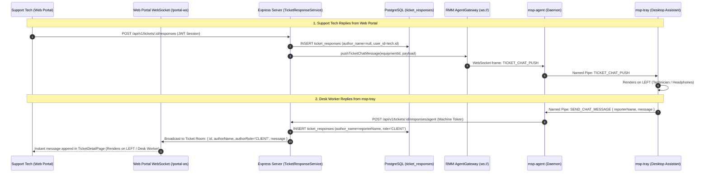

# Implementation Plan: Realtime Ticket Chat & Identity Sync Architecture

**Date:** 2026-09-10  
**Feature:** Bidirectional Realtime Chat & Non-Swapping Identity Model  
**Domains Affected:** `server` (Tickets, RMM Gateway), `client` (`TicketDetailPage`), `packages/msp-tray`  

---

## 1. Architectural Blueprint & Target Data Flow



---

## 2. Dependency Graph

```
Database Schema & Repositories (author_name insert/select)
       │
       ▼
TicketResponseService & TicketController (Role Normalization & Broadcasting)
       │
       ├──────────────────────────────────────┐
       ▼                                      ▼
TicketStreamGateway (Server WebSocket)   LiveChatDrawer (Tray UI Alignment & Polling)
       │
       ▼
useTicketChatStream & TicketDetailPage (Web Portal Realtime UI)
```

---

## 3. Work Phases

- **Phase 1: Persistence & Identity Normalization (Backend)**
  - Ensure `author_name` is persisted on `ticket_responses` and returned by `findByTicket`.
  - Guarantee `getResponsesForAgent` classifies endpoint messages as `CLIENT` and technician replies as `TECHNICIAN`.
- **Phase 2: Bidirectional Web Portal Realtime Stream (Server Gateway)**
  - Implement `TicketStreamGateway` mounting `/portal-ws` on the HTTP server with ticket room multiplexing.
  - Wire `TicketResponseService` to broadcast newly created responses to the ticket room.
- **Phase 3: Web Portal Frontend Realtime Integration (`client`)**
  - Implement `useTicketChatStream` in `client`.
  - Update `TicketResponses.tsx` layout: Desk Worker on the LEFT, Support Staff on the RIGHT.
- **Phase 4: Desktop Assistant UI Alignment & Polling Fallback (`packages/msp-tray`)**
  - Fix role checks in `LiveChatDrawer.tsx` so Desk Worker is on the RIGHT and Support Tech on the LEFT.
  - Add 3-4s background reconciliation when drawer is open.
- **Phase 5: Full Verification & Quality Gate**
  - Run all Vitest test suites on server and client.
  - Build `server`, `client`, `msp-tray`, and `msp-agent`.

---

## 4. Architectural Decision Reference

- [ADR-008: Real-Time Bidirectional Ticket Chat Multiplexing, Room-Based Streaming & Non-Inverting Identity Synchronization](file:///c:/Users/PC/Workspace/msp_client_portal/docs/decisions/ADR-008-realtime-bidirectional-ticket-streaming-and-identity-sync.md)
- **Status:** Complete & Verified. All quality gates, builds, and test suites green.
